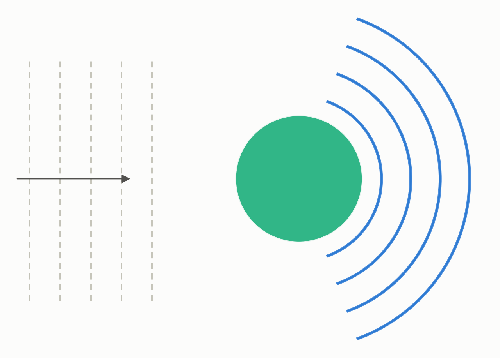
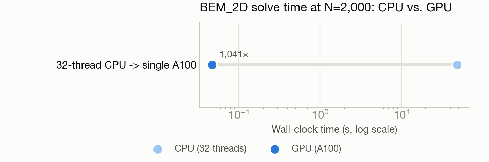

# BEM_2D: 1,041x speedup porting a 2008 PhD electromagnetic-scattering code to CUDA

**Port:** Fortran 90 + OpenMP + LAPACK (CPU) → CUDA / cuSolverDn (NVIDIA A100) · **System:** Polaris · **Status:** :material-rocket-launch-outline: Completed

<figure markdown>
  
  <figcaption>A plane wave scattering off a 2D dielectric cylinder.</figcaption>
</figure>

## The ask

*(No verbatim request on record — paraphrased from the project's documented goal.)*

Port BEM_2D — a roughly 150-file Fortran code from 2008-2010 graduate research solving 2D electromagnetic scattering off a dielectric cylinder — to NVIDIA CUDA, as a test of an agentic build/profile/optimize loop on real HPC infrastructure.

## What happened

The code's runtime is dominated by two steps: assembling a dense matrix and solving it via LU factorization. The real porting challenge wasn't the linear-algebra solve — it was a special mathematical function (a complex Hankel function) buried in 1970s-era Fortran 77 with global state, needed for the physics. Rather than attempt a line-by-line translation, the port wrote a from-scratch GPU replacement using two different numerical series (one for small arguments, one for large) — and deliberately used the identical algorithm on both CPU and GPU, so any numerical mismatch between the two could only come from the linear solve, not the special function.

Five rounds of optimization followed: a naive port, then a GPU-occupancy fix, then fusing the assembly and solve steps to eliminate a slow data round-trip between CPU and GPU memory, then switching to mixed-precision tensor-core hardware for the linear solve while recovering full accuracy through an iterative refinement step, and finally a multi-GPU driver for running many problem sizes at once.

## Results

<figure markdown>
  
  <figcaption>A from-scratch GPU port of a 2008 PhD code, verified bit-identical to the CPU reference.</figcaption>
</figure>

- 1,041x wall-clock speedup at a representative problem size, compared to a 32-thread CPU baseline.
- Every optimization stage produced numerically identical results to the CPU reference, to all printed digits — the tensor-core precision trick recovers full accuracy invisibly.
- Fusing the assembly and solve steps alone cut data movement between CPU and GPU memory by over 5,000x.
- Running the same workload across 8 GPUs on 2 nodes gives close to linear (8x) scaling for parameter sweeps — a sweep that would take days on CPU finishes in under a minute.

[← Back to Performance engineering case studies](index.md)
