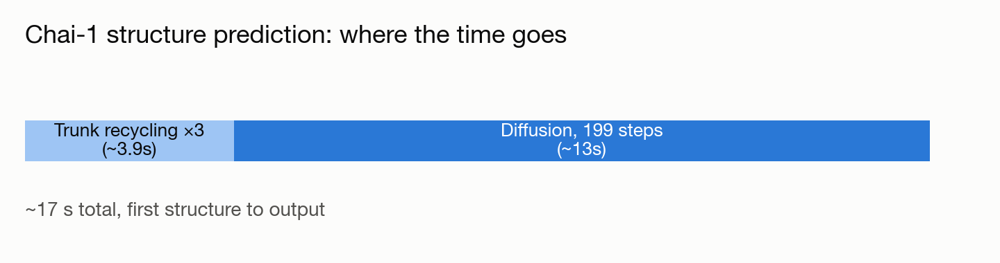

# Getting a lightweight protein-folding model running on Aurora

**Port:** PyTorch/CUDA fork → PyTorch/Intel XPU · **System:** Aurora · **Status:** :material-dna: Completed

<figure markdown>
  
  <figcaption>A folded peptide structure, schematically.</figcaption>
</figure>

## The ask

*(No verbatim request on record — paraphrased from the project's documented goal.)*

A user asked whether AlphaFold2 was available on Aurora; since AlphaFold2 needs a large database and container setup, a lighter-weight alternative model (Chai-1) was installed and verified instead.

## What happened

This is a more modest deployment story than the deep porting efforts elsewhere in this collection — installing an existing community Intel-GPU fork of a protein structure prediction model, and working through the usual first-deployment traps: a package installer silently downgrading to a CPU-only build unless explicitly pinned to the GPU variant, and outbound network access needing to be explicitly configured for the compute environment. A couple of small scheduling-syntax fixes later, a real inference smoke test (a 23-residue test peptide) ran successfully end-to-end on a GPU compute node.

## Results

<figure markdown>
  
  <figcaption>A full structure prediction completes in under 20 seconds once the model is warm.</figcaption>
</figure>

- End-to-end GPU inference verified: model loads, runs its full diffusion-based structure generation, and writes valid output structure files.
- Roughly 16 diffusion steps/second in testing; a full structure prediction completes in under 20 seconds once the model is warm.
- This is a functional-verification result (does it run correctly), not a performance comparison against other hardware.

[← Back to Performance engineering case studies](index.md)
