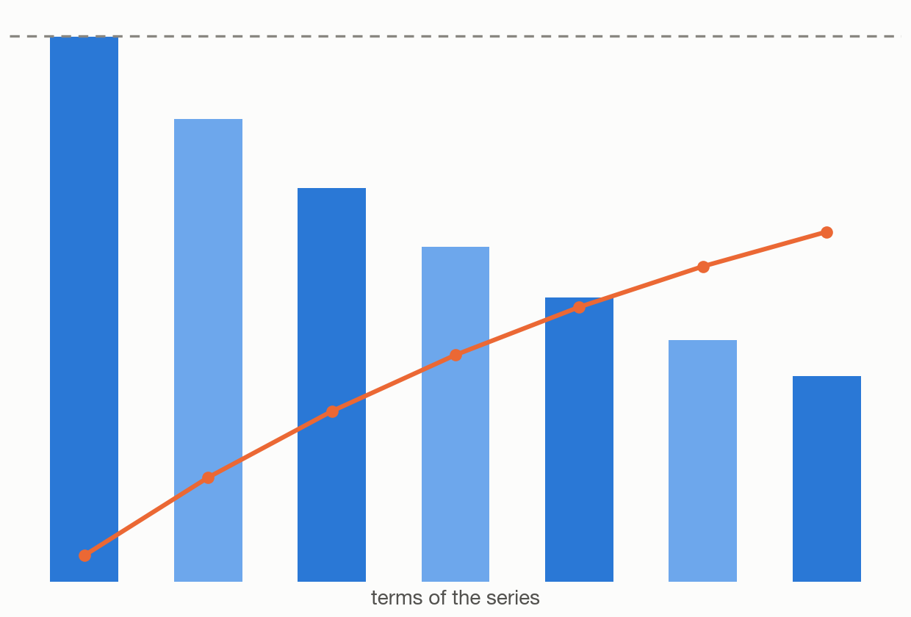
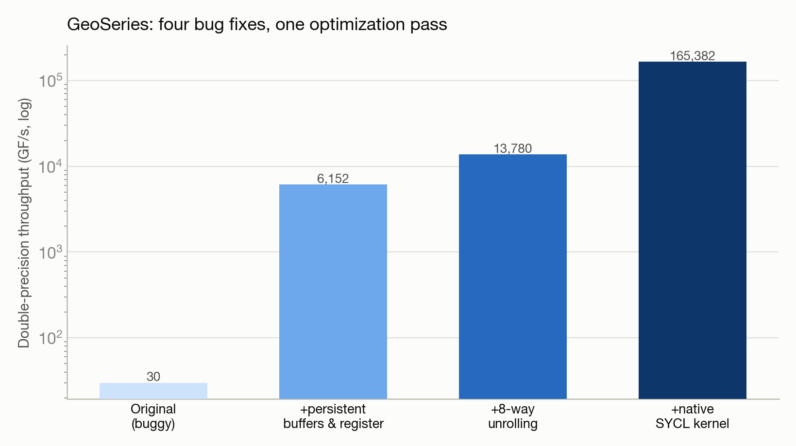

# GeoSeries: a 7,638x speedup from finding four stacked performance bugs

**Optimization:** OpenMP Target offload → tuned OpenMP Target → native SYCL kernel · **System:** Sunspot · **Status:** :material-chart-bell-curve: Completed

<figure markdown>
  
  <figcaption>A geometric series: individual terms and their running sum.</figcaption>
</figure>

## The ask

*(No verbatim request on record — paraphrased from the project's documented goal.)*

Diagnose why a geometric-series benchmark was running dozens to hundreds of times slower than its documented performance target on Intel GPUs, and optimize it as far as possible.

## What happened

This is a textbook systematic-optimization story. Rather than guess-and-check, the investigation used performance-model reasoning to find four independent bugs stacked on top of each other: data was being copied between CPU and GPU memory on every single function call instead of staying resident on the GPU (by far the largest cost); only one loop dimension was being parallelized, leaving the vast majority of the GPU idle; an intermediate calculation was round-tripping through slow memory on every iteration instead of staying in a fast register; and — caught as a side effect of fixing the others — an off-by-one error in how much data was being copied, which had been silently corrupting the answer's precision.

After fixing all four, deeper profiling showed the code was now limited by a different, subtler bottleneck: the GPU's basic arithmetic operations have a fixed latency that a single sequential calculation can't hide, so the fix was restructuring the code to keep 8 independent calculations in flight at once, giving the hardware enough independent work to stay busy. A final step — writing the innermost kernel by hand instead of relying on a compiler-directive-based approach — squeezed out significant further gains by eliminating per-call overhead.

## Results

<figure markdown>
  
  <figcaption>Four independent bugs, fixed one at a time, compound into a 7,638× speedup.</figcaption>
</figure>

- 7,638x total speedup over the original code at the largest tested problem size.
- Final double-precision throughput reached 52% of the GPU node's theoretical peak floating-point performance — 13x above the original performance target for this benchmark.
- Fixing the data-corruption bug as a side effect of the performance fixes also improved numerical accuracy by roughly six orders of magnitude.
- One negative result kept in the writeup rather than discarded: manually overriding certain GPU scheduling parameters actually made performance worse than trusting the compiler's default choices — a useful lesson against over-tuning.

[← Back to Performance engineering case studies](index.md)
