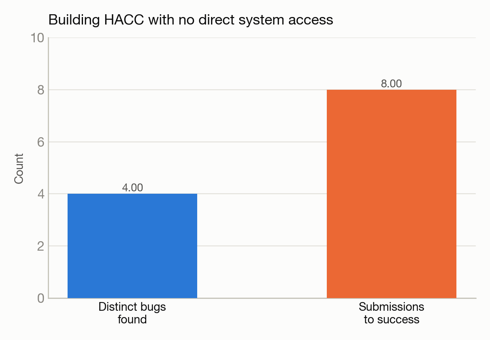

# Building a cosmology simulation code with no direct system access

**Build + run:** HACC cosmology proxy application · **System:** Polaris · **Status:** :material-orbit: Completed

<figure markdown>
  
  <figcaption>A cosmological N-body particle distribution.</figcaption>
</figure>

## The ask

> "Lets build HACC code on Polaris."

Follow-up: "let us run a simulation with it."

## What happened

Trinity first had to research and pick the right variant among several versions of this cosmology code, confirming the choice before proceeding. It then diagnosed and fixed four distinct build failures purely by reading logs retrieved through a file-transfer API — with no direct terminal access to the system at all.

The environment-loading mechanism used by the job-submission API doesn't behave like an interactive login session, so standard software-loading commands silently failed until the right startup configuration was explicitly sourced; the default compiler version was incompatible with the GPU toolkit and had to be swapped; and a newer version of one dependency library had a breaking interface change that required a small patch, applied only to the build script rather than the library's own source.

## Results

<figure markdown>
  
  <figcaption>Every fix came from reading logs alone — no direct terminal access to the system.</figcaption>
</figure>

- Working binary built after 8 submissions across 4 distinct bugs, entirely without direct system access.
- Successfully ran a synthetic cosmological force-calculation problem with about 67 million particles across 4 GPUs, completing in about 5 seconds.
- This is a build-and-functional-run story — no performance comparison against CPU is reported.

[← Back to Performance engineering case studies](index.md)
