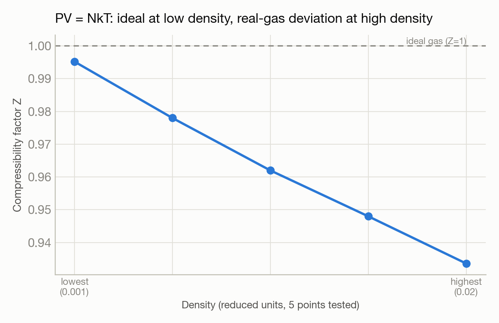

# Designing a physics experiment from a single sentence

**Automation / physics verification:** LAMMPS ideal-gas-law check · **System:** Polaris · **Status:** :material-gas-cylinder: Completed

<figure markdown>
  
  <figcaption>Gas molecules in a simulation box.</figcaption>
</figure>

## The ask

> "run a LAMMPS simulation to show PV=NRT"

## What happened

Given only an outcome to demonstrate — not a simulation spec — Trinity designed the entire experiment itself: chose simplified physical units where the check becomes especially clean, picked five different gas densities spanning from nearly-ideal to noticeably non-ideal behavior, wrote the full simulation setup (equilibration, then a production run with pressure averaging), and wrote the analysis script to compute the compressibility factor (a standard measure of how far a real gas deviates from ideal-gas behavior) at each density.

It also had to self-correct two job-submission failures caused by a scheduling-API detail — a missing initialization step meant standard software-loading commands weren't available on the compute node until the right startup file was explicitly sourced.

## Results

<figure markdown>
  
  <figcaption>Near-ideal at low density, with the expected real-gas deviation appearing at higher density.</figcaption>
</figure>

- Compressibility factor of 0.995 at the most dilute density tested — within 0.5% of the ideal-gas value of exactly 1.0, as expected.
- Correctly reproduced the expected real-gas deviation at higher density (compressibility factor 0.934), consistent with the attractive intermolecular forces built into the simulation model — the right physical trend, not just a number close to 1.
- All 5 simulations completed in about 1 minute of total wall-clock time on 4 GPUs.

[← Back to Performance engineering case studies](index.md)
