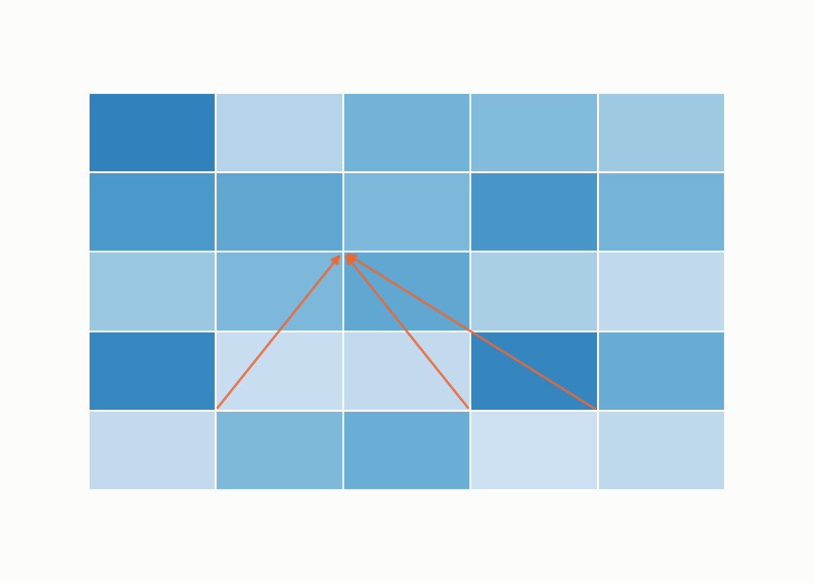
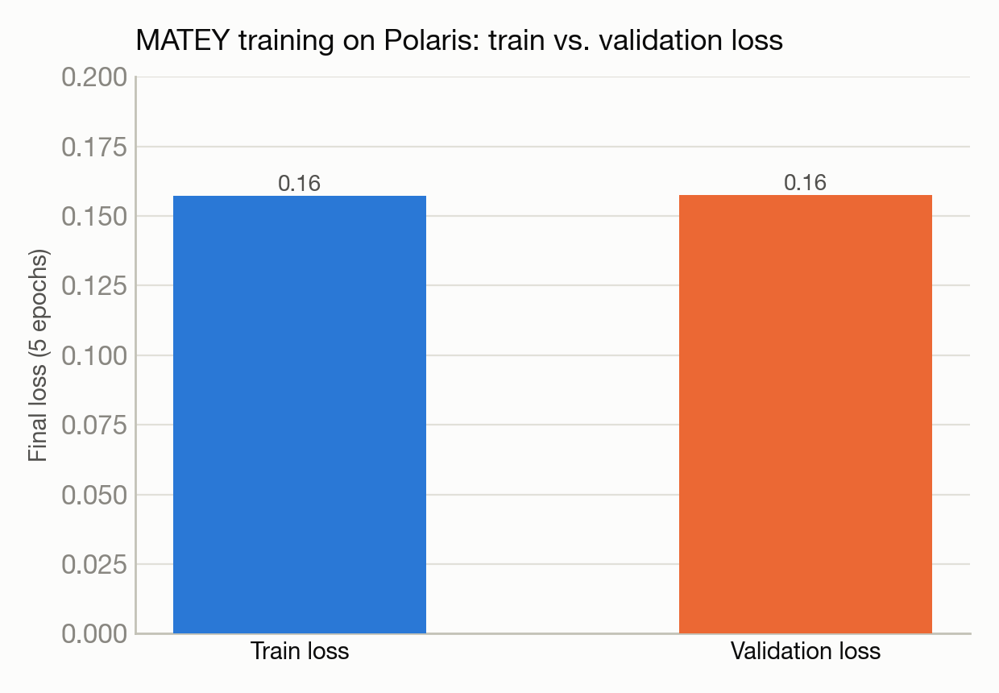

# Porting a spatiotemporal foundation model from AMD to NVIDIA GPUs — in under an hour

**Port:** AMD ROCm / Slurm (Frontier) → NVIDIA CUDA / PBS (Polaris) · **System:** Polaris · **Status:** :material-sync: Completed

<figure markdown>
  
  <figcaption>A spatiotemporal field with an attention mechanism over it.</figcaption>
</figure>

## The ask

*(No verbatim request on record — paraphrased from the project's documented goal.)*

Port MATEY, a spatiotemporal transformer model originally built for Frontier, to run and train on Polaris instead.

## What happened

This is a pure infrastructure-porting story — the model code itself needed no changes, but the surrounding job-launch and hardware-detection logic was written assuming Frontier's specific scheduler and network setup. The port added a compatibility layer so the model's existing distributed-training startup code (written for one scheduler's environment variables) worked unmodified under a different scheduler's variables, fixed a hardcoded network interface name that only exists on Frontier, and resolved a GPU-device-selection conflict between two different ways the code was trying to pick which GPU to use.

The entire process — from first looking at the codebase to a working multi-GPU training run — took about 55 minutes and 10 job submissions to clear 6 distinct runtime errors, entirely autonomously.

## Results

<figure markdown>
  
  <figcaption>Train and validation loss track each other closely — no sign of overfitting after the port.</figcaption>
</figure>

- Successful multi-GPU (4 GPUs) training run completed on the new system: 5 epochs, with training and validation loss both decreasing as expected (final values 0.157 for both).
- Whole port completed in roughly 55 minutes with no human intervention between job submissions.
- This is a functional/correctness story (does it train correctly on the new hardware), not a speed comparison — no performance-vs-original-system number is reported.

[← Back to Performance engineering case studies](index.md)
