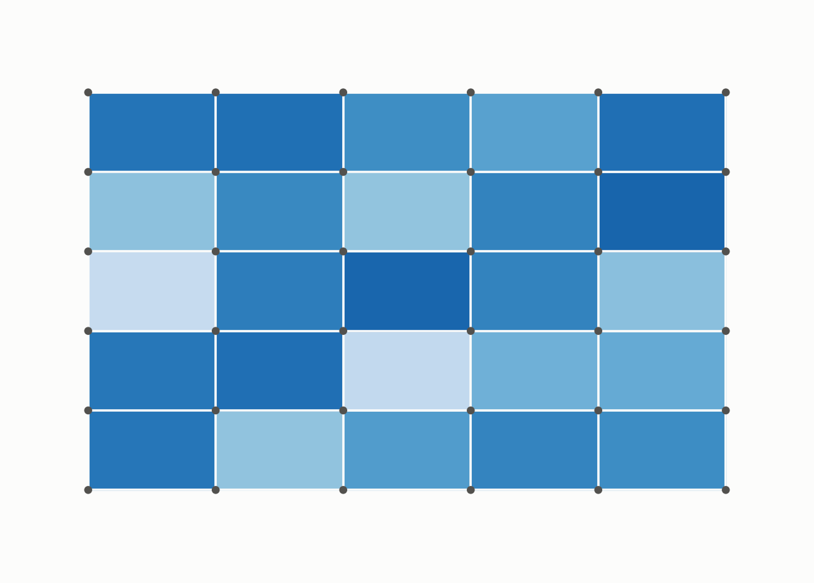
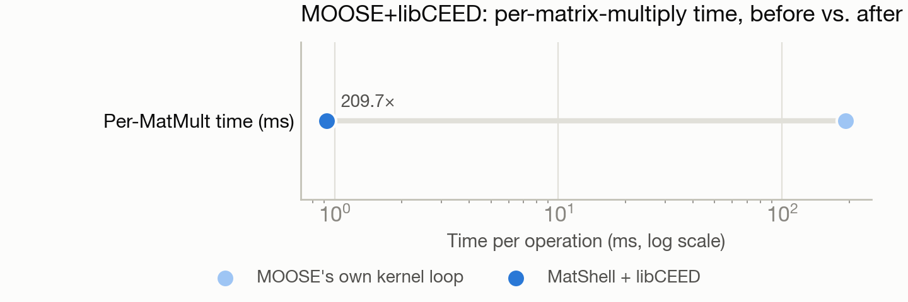

# Porting a multiphysics finite-element framework across GPU vendors — and a 209x kernel speedup

**Port:** CUDA (NVIDIA A100, Polaris) → SYCL/oneAPI (Intel GPU, Sunspot) · **System:** Sunspot · **Status:** :material-chip: Completed

<figure markdown>
  
  <figcaption>A finite-element mesh with a diffusing field.</figcaption>
</figure>

## The ask

*(No verbatim request on record — paraphrased from the project's documented goal.)*

Port MOOSE (a widely-used multiphysics finite-element framework) and its GPU operator library from NVIDIA to Intel GPUs, and get real acceleration out of the port, not just a working build.

## What happened

This was the most operationally complex effort in the collection — roughly two weeks and dozens of iterations porting a large C++ framework linked against several other scientific libraries across GPU vendors. Getting a working cross-vendor build was the first hurdle (compiler flag mismatches, missing build-system components, a library crash needing a source patch).

The bigger challenge was architectural: the framework's own internal design fires certain hooks in an order that made a straightforward port only marginally faster, because the expensive linear-algebra library was still running on the CPU host rather than the GPU. After rebuilding that library for GPU too, further profiling revealed that 99.8% of the remaining cost was the framework's own generic per-element loop — not the GPU math library itself — so the port bypassed that loop entirely with a direct GPU operator call. This surfaced three genuinely obscure vendor-specific bugs (a flag being silently ignored, a resource-cleanup routine corrupting the GPU driver's memory allocator when called repeatedly, and an initialization conflict between two GPU programming layers). A final correctness bug — using the wrong style of numbering for computational elements when running across multiple processes — worked fine on one process but silently broke on many, and was caught and fixed before being promoted to production use.

## Results

<figure markdown>
  
  <figcaption>Bypassing the framework's own per-element loop was worth far more than the GPU port itself.</figcaption>
</figure>

- 3.26x end-to-end wall-time speedup for a representative solve.
- 209.7x speedup specifically on the core matrix-multiply operation once the framework's own per-element loop was bypassed — verified bit-for-bit against the standard (unported) result.
- Multi-process scaling confirmed correct after the numbering bug fix (1.65x speedup on 8 processes vs. 1 process on CPU for the same problem).
- One open item disclosed honestly: a specific 4-process configuration with an advanced preconditioner still crashes intermittently; root cause not yet resolved.

[← Back to Performance engineering case studies](index.md)
