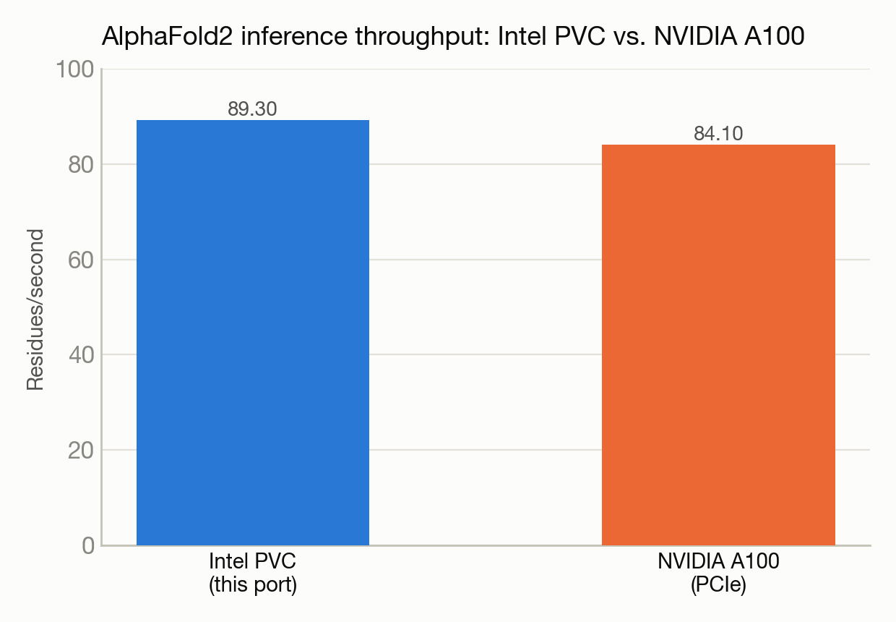

# Porting an AlphaFold2 reimplementation to Intel GPUs — finding the second hidden kernel

**Port:** PyTorch/CUDA → PyTorch/Intel XPU (SYCL) · **System:** Sunspot · **Status:** :material-dna: Completed

<figure markdown>
  
  <figcaption>A folded protein structure, schematically.</figcaption>
</figure>

## The ask

*(No verbatim request on record — paraphrased from the project's documented goal.)*

Port OpenFold (a training-capable, open-source reimplementation of AlphaFold2) to run on Intel GPUs, since it ships custom CUDA kernels with no Intel equivalent out of the box.

## What happened

This was a systematic, iteration-by-iteration compatibility sweep — a mismatched settings object, a missing tensor dimension, several missing input features one at a time — before hitting the real challenge: a custom fused-attention CUDA kernel with no direct Intel equivalent. The port fixed the obvious call site (the main attention module) with a mathematically equivalent, hardware-independent implementation — only to find a second, completely separate call site for the same underlying CUDA kernel, hardcoded deep inside a different part of the model (the structure-prediction module) that bypasses the first fix entirely.

The lesson, stated plainly in the writeup: a port that only patches the obvious abstraction will get partway through the model and then fail somewhere else — you have to find every call site, not just the first one you notice.

## Results

<figure markdown>
  
  <figcaption>A single Intel GPU tile edges out a PCIe A100 on this specific inference workload.</figcaption>
</figure>

- Full model forward pass verified end-to-end on Intel GPU hardware, with no silent fallback to CPU anywhere in the computation.
- 7 distinct compatibility issues resolved across the port.
- A follow-on benchmark found the single-GPU Intel hardware used here about 6% faster than a comparable (PCIe, not the top-tier) NVIDIA A100 for this specific inference workload — an interesting data point, though not a fully apples-to-apples comparison (different A100 variant, one specific model configuration).

[← Back to Performance engineering case studies](index.md)
