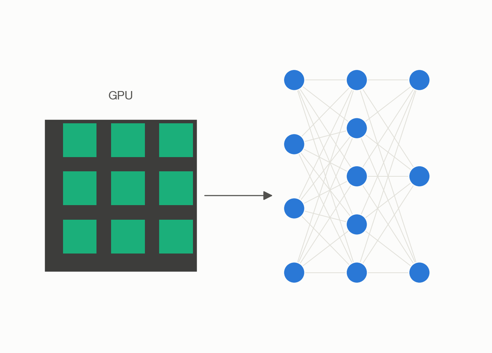
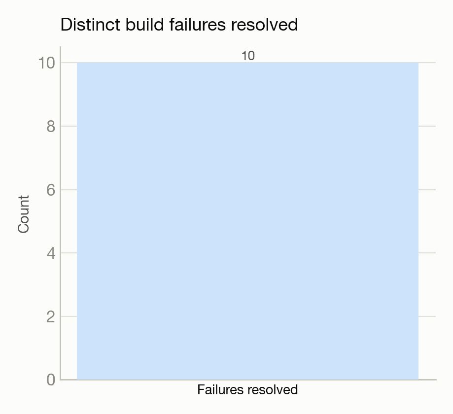

# Building PyTorch on a system where the usual submission paths didn't work

**Build:** PyTorch source → CUDA + MPI build · **System:** Sophia · **Status:** :material-server: Completed

<figure markdown>
  
  <figcaption>A GPU feeding a neural network.</figcaption>
</figure>

## The ask

*(No verbatim request on record — paraphrased from the project's documented goal.)*

Build PyTorch from source with MPI support on Sophia.

## What happened

The most infrastructure-discovery-heavy of the build efforts — both of the usual automated job-submission paths failed outright on this system, forcing a fallback to a lower-level, more direct task-submission method. The build itself then hit ten distinct failures across many attempts, the subtlest being a dependency-resolution trap: installing from two different software channels silently pulled in a newer, incompatible version of the GPU toolkit on top of the intended one, producing a build that wouldn't run on this system's older GPU driver — fixed by explicitly pinning every GPU-toolkit-related package to a consistent, compatible version.

## Results

<figure markdown>
  
  <figcaption>Ten distinct build failures, mostly dependency-version conflicts, resolved end to end.</figcaption>
</figure>

- Two verified working installs, both with GPU acceleration, MPI, and both major GPU communication libraries enabled.
- Verified correct GPU matrix-multiply results and successful multi-process CPU communication tests on both installs.
- One real limitation noted honestly: direct GPU-to-GPU communication over MPI isn't available with this particular software combination — the GPU-native communication library is recommended instead for GPU-to-GPU work.

[← Back to Performance engineering case studies](index.md)
