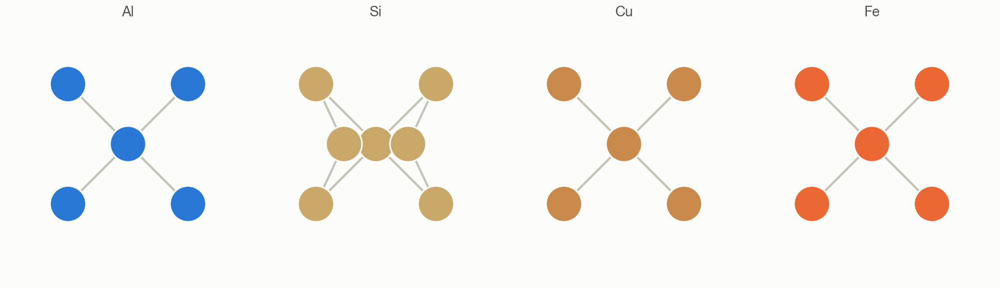
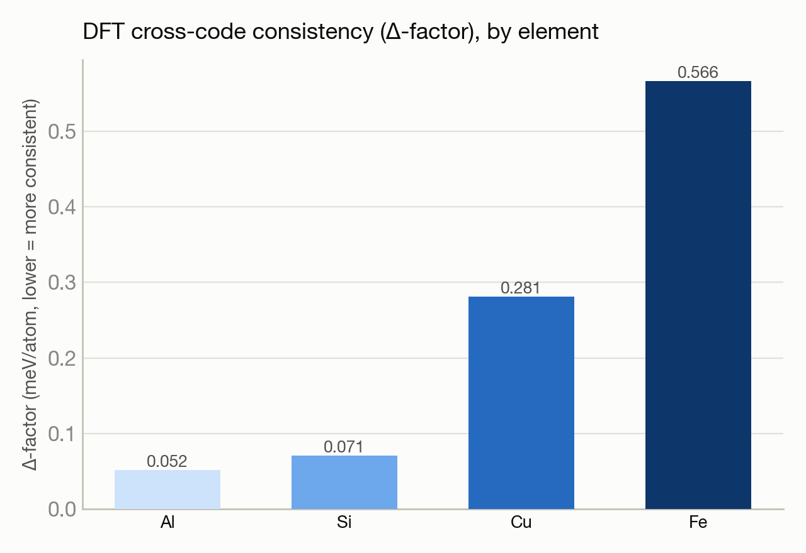

# Do different DFT codes agree with each other? Testing 4 elements

**Reproducing:** *Reproducibility in density functional theory calculations of solids* (Lejaeghere et al., Science 351, 2016). DOI: 10.1126/science.aad3000
**System:** Crux · **Status:** :material-scale-balance: Completed for this subset

<figure markdown>
  
  <figcaption>Four different crystal structures, one per element tested.</figcaption>
</figure>

## The goal

This landmark paper compared 15 different DFT codes across 71 elements to establish a standard "consistency score" (the Δ-factor) for cross-code reproducibility. This reproduction checks whether a specific code and pseudopotential setup falls within the paper's "well-converged" cluster, using a representative 4-element subset rather than the full 71-element sweep.

## What happened

Equation-of-state calculations (energy vs. volume) were run for aluminum, silicon, iron, and copper — chosen to cover a simple metal, a semiconductor, and both magnetic and non-magnetic transition metals. All four produced clean energy-vs-volume curves fit to a standard equation of state, then compared against the canonical reference dataset the original paper itself used as its cross-code yardstick. No PDF of the original paper's own per-code table was available, so the comparison is against this public reference standard rather than the paper's exact numbers — disclosed rather than glossed over.

## Results

<figure markdown>
  
  <figcaption>Iron — the paper's own flagged hardest case — shows the largest deviation, exactly as expected.</figcaption>
</figure>

- All four elements passed the acceptance bar for a well-converged, modern DFT setup, with a mean consistency score of 0.242 meV/atom.
- Individual scores: aluminum 0.052, silicon 0.071, copper 0.281, iron 0.566 meV/atom.
- Iron — the paper's own flagged hardest case, being magnetic — showed the largest deviation, exactly as the original paper's methodology would predict.
- One specific quantity (iron's pressure-derivative of bulk modulus) was flagged as a real outlier (about 13% off the reference) and discussed openly rather than hidden.

[← Back to Paper reproductions](index.md)
