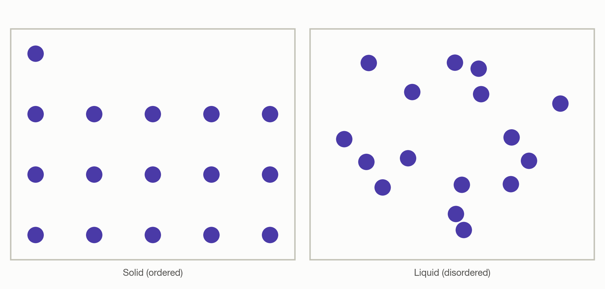
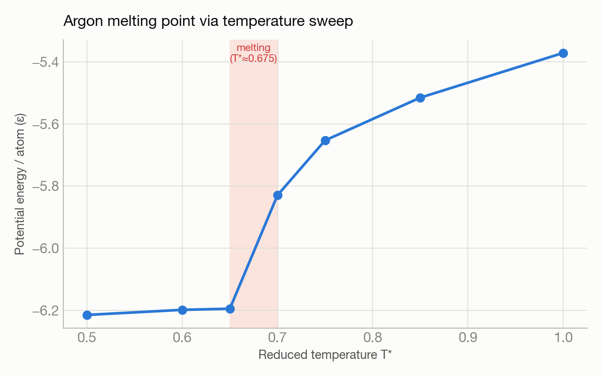

# Finding argon's melting point via molecular dynamics

**System(s):** Polaris · **Code:** LAMMPS · **Outcome:** :material-snowflake-thermometer: Success

<figure markdown>
  
  <figcaption>Argon atoms: ordered in the solid, disordered in the liquid.</figcaption>
</figure>

## The ask

*(This campaign predates verbatim prompt logging — the request below is reconstructed from the campaign's documented design, not a direct quote.)*

> "Find the melting point of argon by running a temperature sweep and looking for the solid-to-liquid transition."

## What happened

Trinity ran a 7-temperature sweep (reduced temperatures 0.50–1.00) of a 4,000-atom Lennard-Jones argon system on a single GPU node, tracking potential energy and mean-squared displacement (a diffusion indicator) at each temperature to locate the phase transition.

## Results

<figure markdown>
  
  <figcaption>A sharp jump in potential energy between T*=0.65 and 0.70 marks the melting point.</figcaption>
</figure>

- A sharp discontinuity appeared between reduced temperatures 0.65 and 0.70: potential energy jumped and mean-squared displacement increased roughly 870-fold — the signature of a solid-to-liquid transition.
- Measured melting point: reduced temperature ≈0.675, matching the literature value of ≈0.70 for this model.
- GPU performance: roughly 1,875 timesteps/second on 4 GPUs.

[← Back to Science campaigns](index.md)
