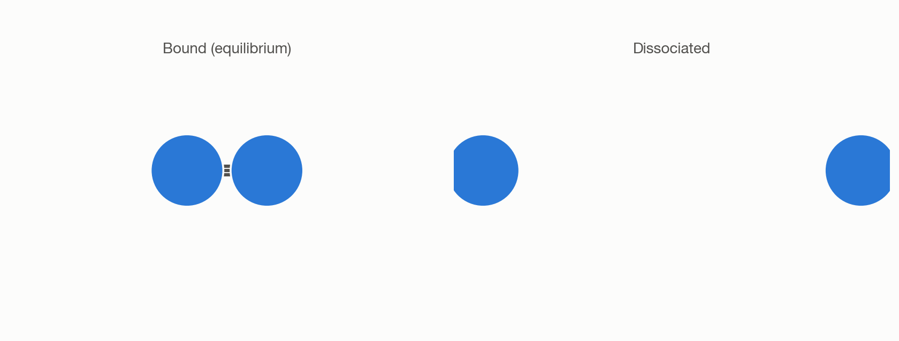
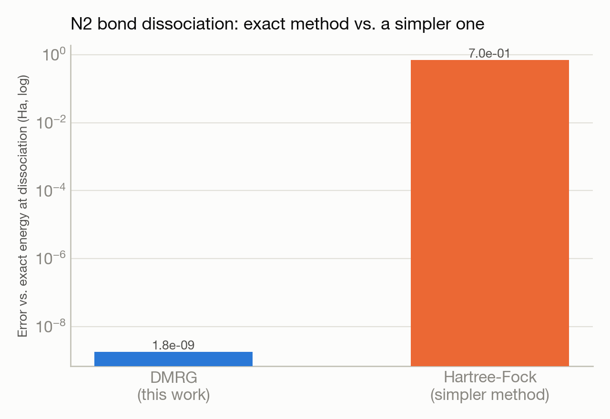

# Breaking a nitrogen molecule apart, three ways, across three supercomputers

**System(s):** Aurora, Crux & Frontier · **Code:** block2 (DMRG) · **Outcome:** :material-molecule: Success

<figure markdown>
  
  <figcaption>A nitrogen molecule's triple bond, bound and dissociated.</figcaption>
</figure>

## The ask

*(This campaign predates verbatim prompt logging — the request below is reconstructed from the campaign's documented design, not a direct quote.)*

> "Compute the N2 triple-bond dissociation curve using the density matrix renormalization group (DMRG) method, and verify it matches exact full configuration interaction at the equilibrium bond length."

## What happened

Breaking a nitrogen molecule's very strong triple bond is a classic hard test for quantum chemistry methods — simpler methods qualitatively fail as the bond stretches. Trinity ran the more sophisticated DMRG method across a range of bond lengths and cross-validated it against a numerically exact reference method at the equilibrium geometry, then ran the same calculation on three different supercomputers to confirm consistency.

## Results

<figure markdown>
  
  <figcaption>DMRG stays exact at dissociation where a simpler mean-field method breaks down by ~9 orders of magnitude.</figcaption>
</figure>

- DMRG matched the numerically exact reference method to within 1.8×10⁻⁹ Hartree at the equilibrium bond length — essentially exact agreement.
- A simpler mean-field method (Hartree-Fock) was shown to fail by 0.6–0.8 Hartree at full dissociation, the expected qualitative breakdown this study set out to demonstrate.
- Successfully run and cross-checked on three different systems (Aurora, Crux, Frontier), confirming portability of the method across facilities.

[← Back to Science campaigns](index.md)
