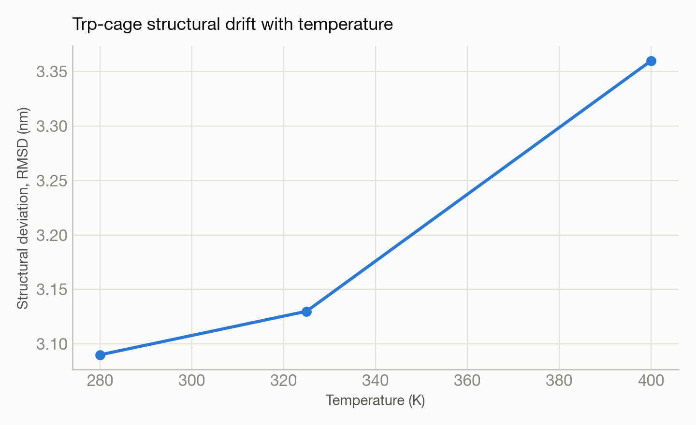

# Trp-cage mini-protein thermal stability across three temperatures

**System(s):** Polaris · **Code:** GROMACS · **Outcome:** :material-dna: Success

<figure markdown>
  
  <figcaption>A folded protein structure, schematically.</figcaption>
</figure>

## The ask

*(This campaign predates verbatim prompt logging — the request below is reconstructed from the campaign's documented design, not a direct quote.)*

> "Simulate the Trp-cage mini-protein at three temperatures and see how its structure responds to heating."

## What happened

Trinity ran three 500-picosecond simulations of the well-studied Trp-cage mini-protein (~3,000 atoms including solvent) at increasing temperatures, tracking structural deviation from the starting conformation as a stability indicator. It hit and worked around a scheduler configuration trap (a compute queue that silently blocked access to needed software) before completing all three runs.

## Results

<figure markdown>
  
  <figcaption>Structural deviation from the starting fold grows steadily with temperature.</figcaption>
</figure>

- Structural deviation increased steadily with temperature (3.09 → 3.13 → 3.36 nm RMSD from 280 K → 325 K → 400 K) — the expected trend for a protein becoming less stable as it heats.
- Performance: roughly 956 nanoseconds of simulated time per day on a single GPU.

[← Back to Science campaigns](index.md)
