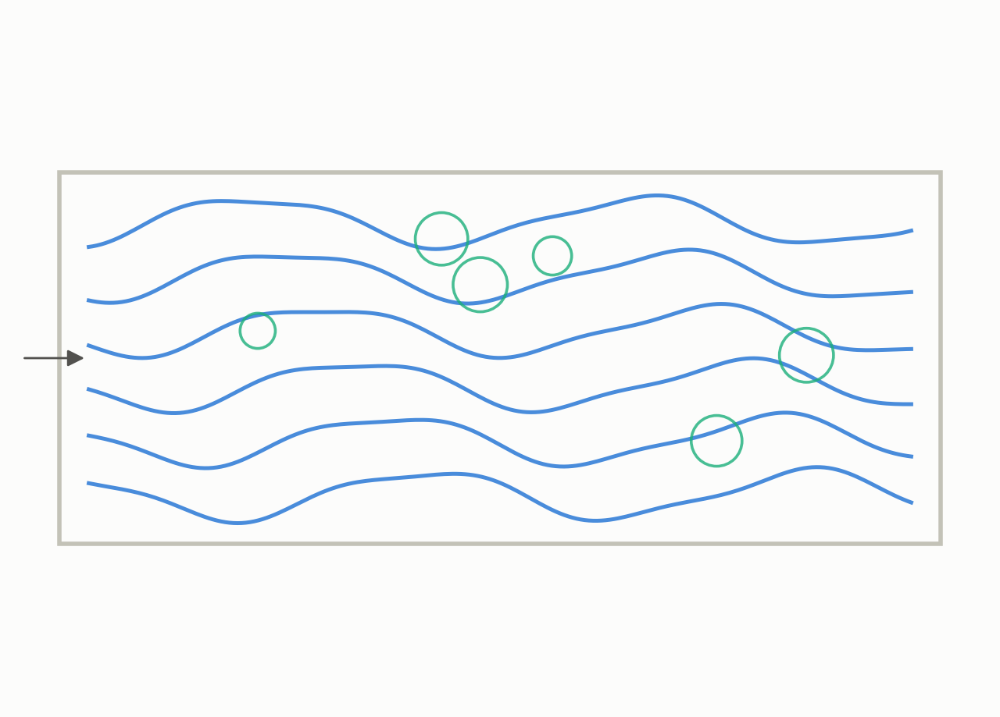
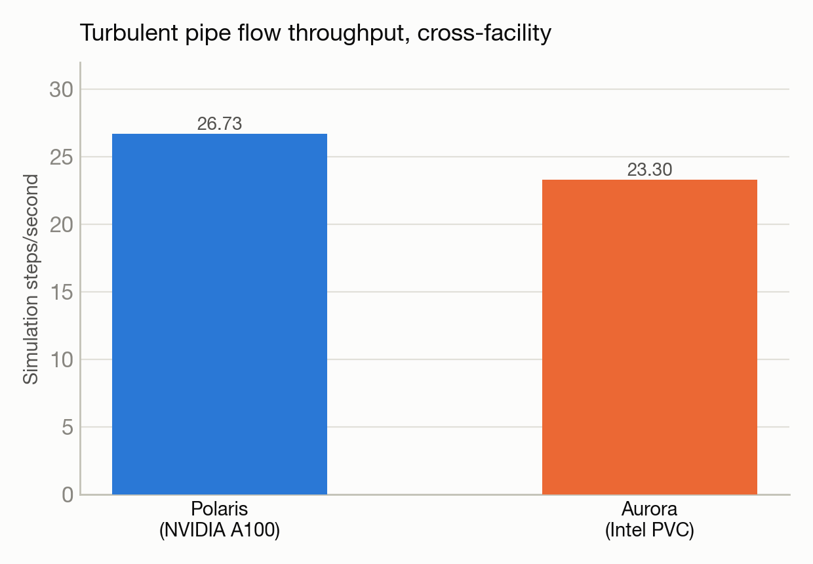

# Turbulent pipe flow across two facilities: Polaris vs. Aurora

**System(s):** Polaris & Aurora · **Code:** NekRS · **Outcome:** :material-sync: Success

<figure markdown>
  
  <figcaption>Turbulent flow through a pipe.</figcaption>
</figure>

## The ask

*(This campaign predates verbatim prompt logging — the request below is reconstructed from the campaign's documented design, not a direct quote.)*

> "Run the same turbulent pipe-flow simulation (Reynolds number 5200) on both Polaris and Aurora and compare performance."

## What happened

Trinity ran an identical spectral-element CFD simulation of turbulent flow through a pipe on both Polaris (NVIDIA GPUs) and Aurora (Intel GPUs), a genuine cross-facility comparison. The Polaris run worked on the first try. The Aurora run took five iterations to get right — the compute backend name had to be set correctly for Intel's compiler stack, and a stale build cache from a previous run had to be cleared before Aurora would pick up the right MPI configuration.

## Results

<figure markdown>
  
  <figcaption>Aurora reached about 87% of Polaris's throughput on the same physics problem.</figcaption>
</figure>

- Polaris: 26.73 simulation steps/second.
- Aurora: 23.3 steps/second — about 87% of Polaris's throughput on equivalent hardware generations, a useful cross-facility performance data point.
- Both runs produced numerically stable turbulent flow advancement, confirming the same physics setup works correctly on both vendors' hardware.

[← Back to Science campaigns](index.md)
