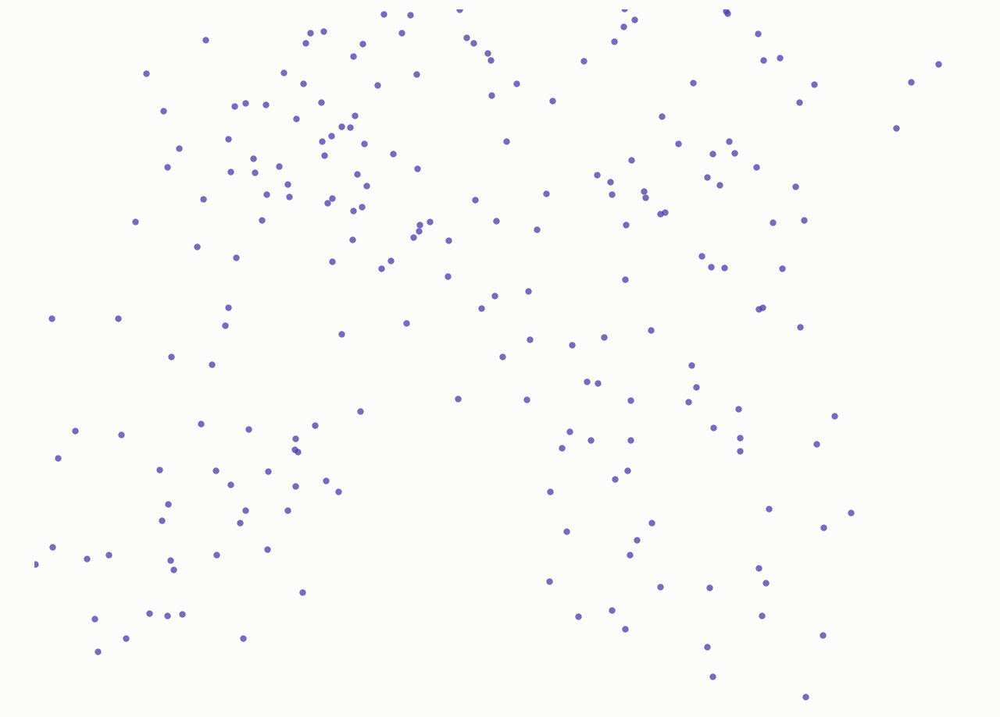
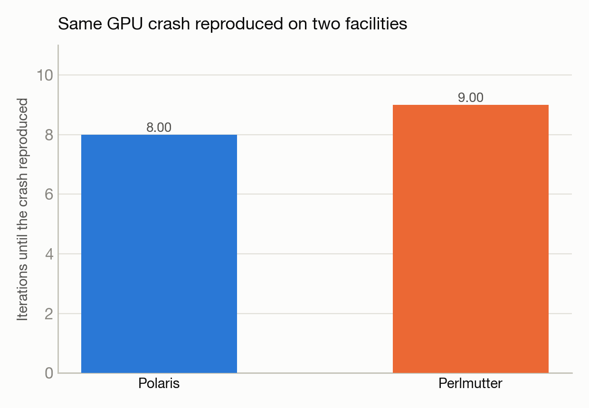

# Reproducing the same GPU bug on two different supercomputers

**System(s):** Polaris & Perlmutter · **Code:** HACC (cosmology N-body) · **Outcome:** :material-bug-outline: Bug confirmed

<figure markdown>
  
  <figcaption>A cosmological N-body particle distribution.</figcaption>
</figure>

## The ask

*(This campaign predates verbatim prompt logging — the request below is reconstructed from the campaign's documented design, not a direct quote.)*

> "Run the HACC cosmology N-body proxy application on Polaris and Perlmutter and compare results."

## What happened

Trinity worked through several rounds of command-line argument discovery to get the HACC cosmology code running (its interface isn't self-documenting), then hit a GPU memory crash. After reducing problem size to avoid a straightforward out-of-memory error, it hit a deeper illegal-memory-access crash in the GPU force-calculation kernel — on Polaris. It then ran the identical binary on Perlmutter's equivalent NVIDIA GPUs and reproduced the exact same crash. Independently reproducing the same failure on two different facilities with different software environments confirms it's a real defect in the application's GPU code, not a local configuration problem.

## Results

<figure markdown>
  
  <figcaption>The same illegal-memory-access crash appeared on both facilities — a code bug, not a config issue.</figcaption>
</figure>

- Identical "illegal memory access" crash in the GPU short-range force kernel confirmed on both Polaris and Perlmutter, on the same GPU architecture.
- Conclusion: this is a code-level defect in the application, not a deployment or environment issue — a finding that saves future users from chasing a phantom configuration bug.

[← Back to Science campaigns](index.md)
