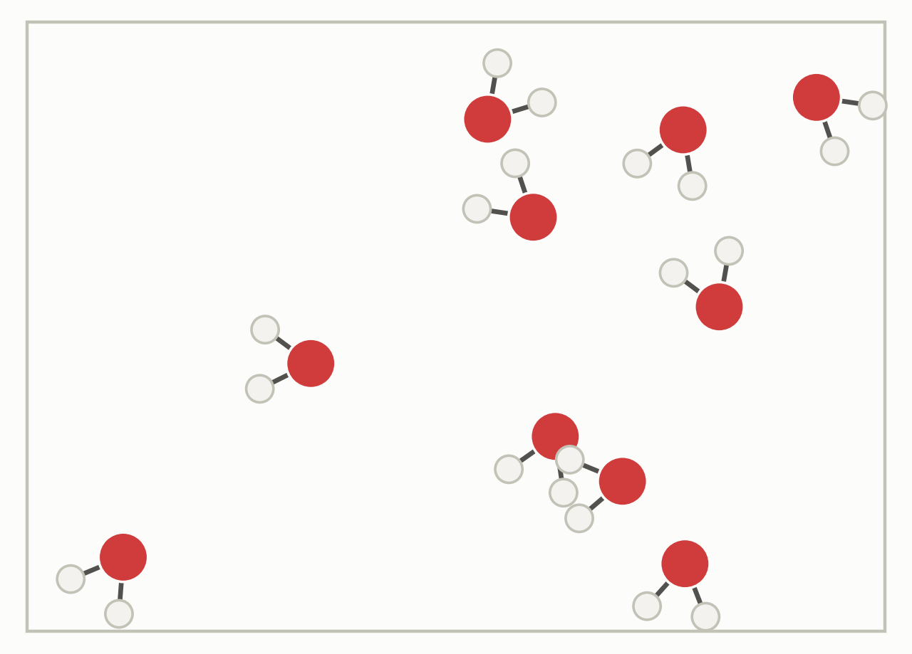
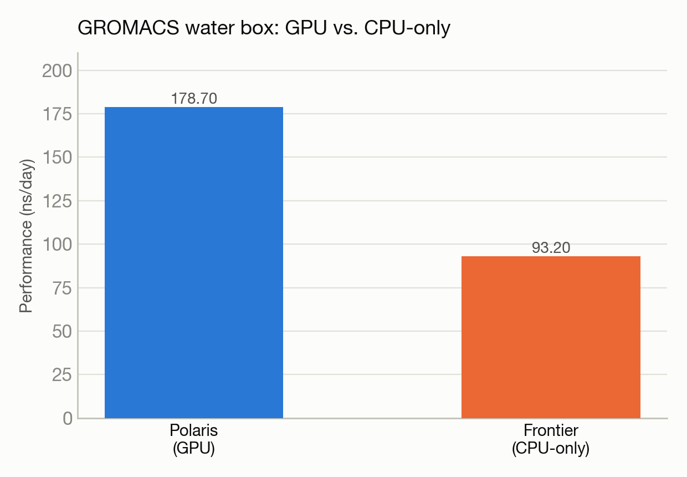

# GROMACS water box: GPU (Polaris) vs. CPU-only (Frontier)

**System(s):** Polaris & Frontier · **Code:** GROMACS · **Outcome:** :material-sync: Success

<figure markdown>
  
  <figcaption>A box of water molecules.</figcaption>
</figure>

## The ask

*(This campaign predates verbatim prompt logging — the request below is reconstructed from the campaign's documented design, not a direct quote.)*

> "Run the same GROMACS water-box benchmark on Polaris (GPU) and Frontier (CPU-only) and compare performance."

## What happened

Trinity ran a standard water-box molecular dynamics benchmark on both systems. On Polaris, it worked around a filesystem-access restriction on compute nodes and a thread-count conflict with the job scheduler, plus needed an energy-minimization step before the main simulation to avoid constraint-solver errors. On Frontier, it had to bypass a scheduler-integration issue by submitting the job through the login node directly, and had to explicitly reset a thread-count environment variable that the system's compiler modules reset to an unwanted default. This CPU-only Frontier baseline is what a follow-on engineering effort later used as the comparison point when adding GPU support to GROMACS on Frontier.

## Results

<figure markdown>
  
  <figcaption>This CPU-only Frontier baseline later became the comparison point for a GPU-porting effort.</figcaption>
</figure>

- Polaris (GPU, 7,404 atoms): 178.7 nanoseconds/day.
- Frontier (CPU-only, 4,536 atoms): 93.2 nanoseconds/day.
- Both runs completed cleanly and established real cross-facility performance baselines for this workload.

[← Back to Science campaigns](index.md)
