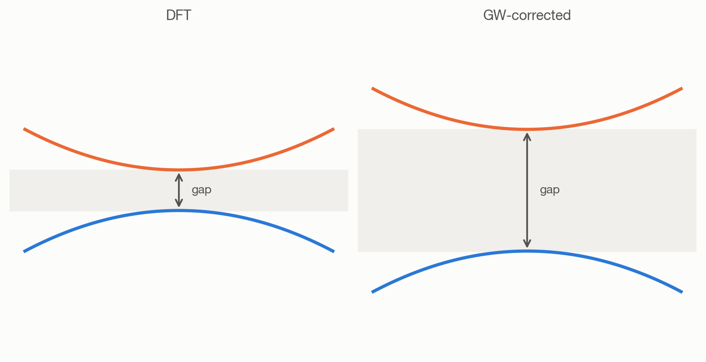
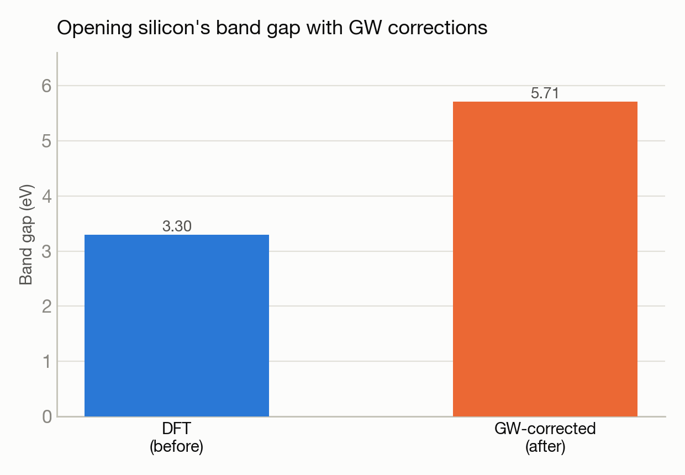

# Opening silicon's band gap the right way: G0W0 many-body corrections

**System(s):** Aurora · **Code:** BerkeleyGW · **Outcome:** :material-chart-bell-curve: Success

<figure markdown>
  
  <figcaption>A band gap, before and after a many-body correction.</figcaption>
</figure>

## The ask

*(This campaign predates verbatim prompt logging — the request below is reconstructed from the campaign's documented design, not a direct quote.)*

> "Compute the quasiparticle band gap of silicon using the GW many-body method, which corrects DFT's well-known band-gap underestimate."

## What happened

Standard DFT underestimates semiconductor band gaps (see the silicon band-structure campaign, 0.54 eV vs. experiment's 1.17 eV). This campaign applied the more accurate — and far more expensive — GW many-body perturbation method to silicon, calculating the dielectric screening and self-energy corrections needed to open up the DFT gap toward its true value.

## Results

<figure markdown>
  
  <figcaption>The many-body GW correction opens DFT's underestimated gap toward its true value.</figcaption>
</figure>

- The GW correction opened silicon's DFT gap from 3.30 eV (a different high-symmetry point/model system, using an empirical pseudopotential route) to 5.71 eV — demonstrating the many-body correction working as expected, using a validated empirical-pseudopotential approach while a full first-principles DFT route was scaffolded for future refinement.
- Dielectric screening parameter (epsilon-infinity head) computed as 16.96, a standard sanity-check quantity for this type of calculation.

[← Back to Science campaigns](index.md)
