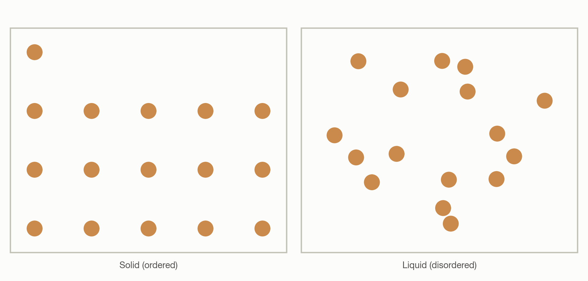
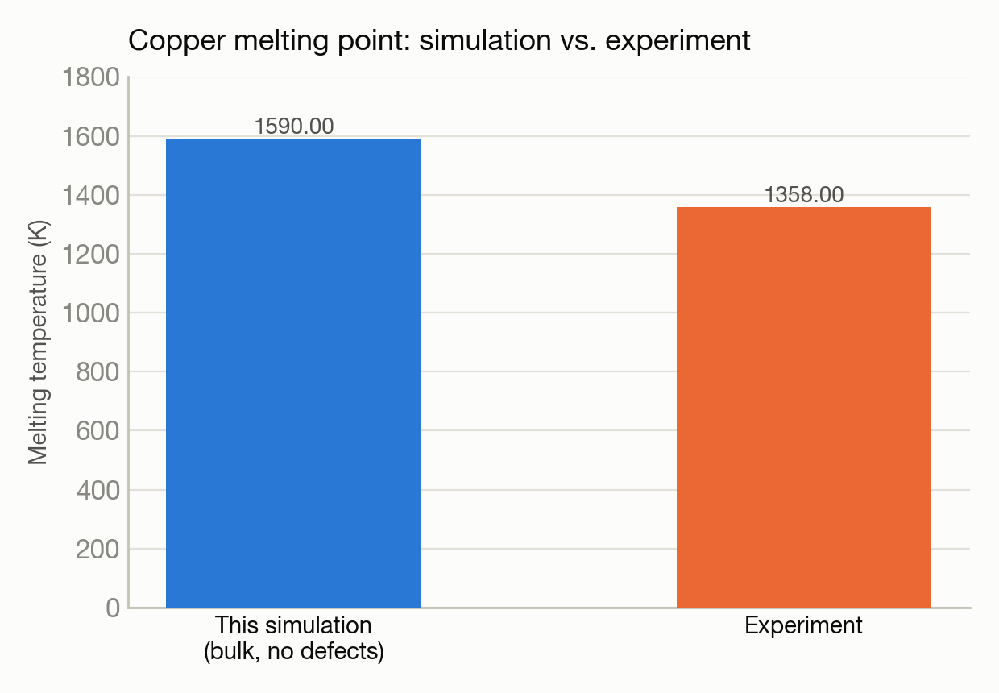

# Copper's melting point via a heating-ramp simulation

**System(s):** Polaris · **Code:** LAMMPS · **Outcome:** :material-thermometer: Success

<figure markdown>
  
  <figcaption>Copper atoms: ordered in the solid, disordered in the liquid.</figcaption>
</figure>

## The ask

*(This campaign predates verbatim prompt logging — the request below is reconstructed from the campaign's documented design, not a direct quote.)*

> "Determine copper's melting point by simulating a continuous heating ramp rather than discrete temperature sweeps."

## What happened

Unlike the discrete-temperature argon study, this campaign heated a copper crystal continuously and watched for the volume discontinuity that marks melting in real time.

## Results

<figure markdown>
  
  <figcaption>The simulated bulk crystal superheats past the true melting point — an expected artifact with no surface to nucleate melting.</figcaption>
</figure>

- Solid-to-liquid volume discontinuity observed at approximately 1,590 K.
- This is higher than copper's experimental melting point (1,358 K) — expected "superheating" behavior for a bulk crystal without a free surface or defect to nucleate melting, a well-known artifact of this simulation method rather than an error.

[← Back to Science campaigns](index.md)
