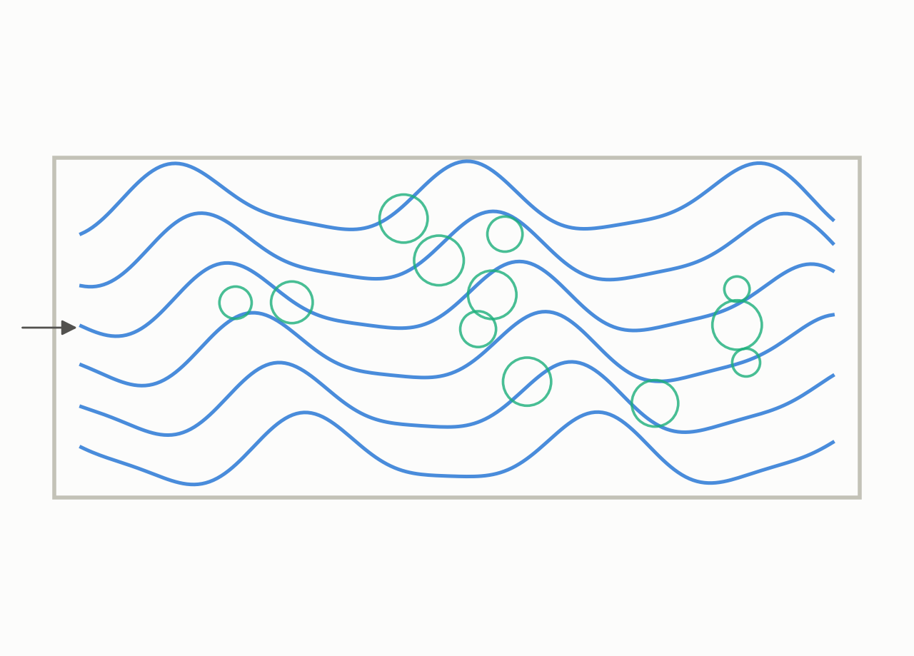
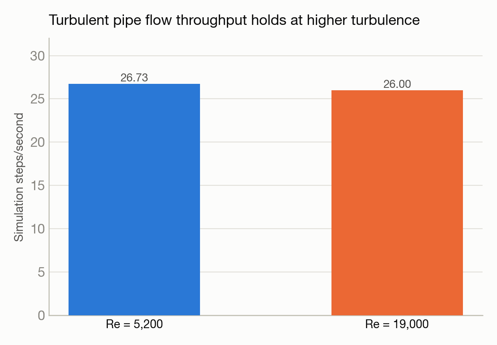

# Pushing turbulent pipe flow to a higher Reynolds number

**System(s):** Polaris · **Code:** NekRS · **Outcome:** :material-speedometer: Success

<figure markdown>
  
  <figcaption>Turbulent flow through a pipe, at higher turbulence.</figcaption>
</figure>

## The ask

*(This campaign predates verbatim prompt logging — the request below is reconstructed from the campaign's documented design, not a direct quote.)*

> "Extend the turbulent pipe-flow study (Reynolds number 5200) to a much higher, more turbulent Reynolds number of 19,000."

## What happened

This campaign pushed the same spectral-element CFD method used in the earlier pipe-flow study to a substantially more turbulent flow regime, testing whether the method and infrastructure remain stable and performant at higher turbulence intensity.

## Results

<figure markdown>
  
  <figcaption>Throughput barely changes even though the flow is far more turbulent.</figcaption>
</figure>

- Stable, numerically well-behaved flow advancement at Reynolds number 19,000 on 4 GPUs.
- Throughput of about 26 steps/second — essentially matching the lower-Reynolds-number result on equivalent hardware, showing the method scales to more demanding turbulence without a performance penalty.

[← Back to Science campaigns](index.md)
