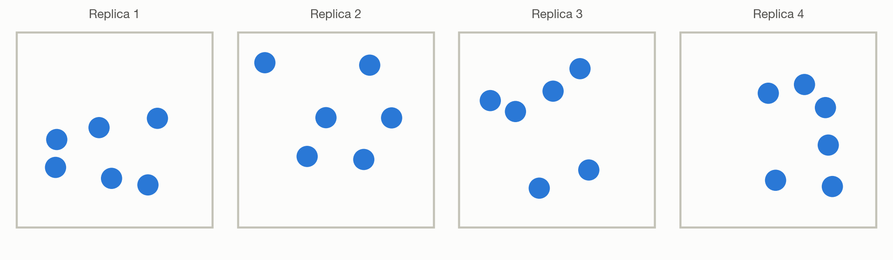
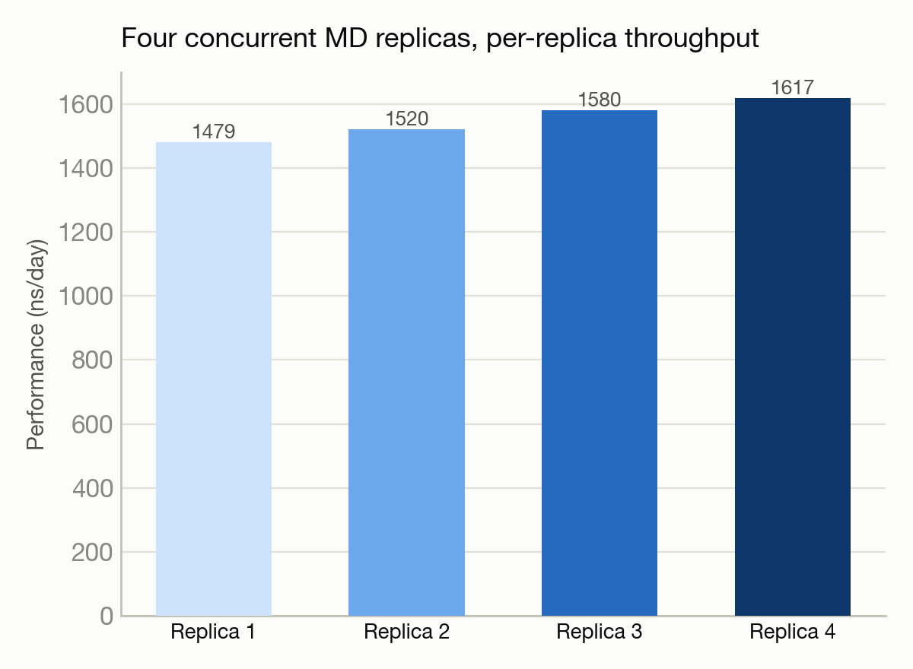

# Running four molecular dynamics replicas at once

**System(s):** Polaris · **Code:** GROMACS · **Outcome:** :material-cube-outline: Success

<figure markdown>
  
  <figcaption>Four independent simulation boxes running concurrently.</figcaption>
</figure>

## The ask

*(This campaign predates verbatim prompt logging — the request below is reconstructed from the campaign's documented design, not a direct quote.)*

> "Run an ensemble of 4 independent molecular dynamics replicas simultaneously to test multi-replica throughput."

## What happened

Rather than one simulation, Trinity launched 4 independent replicas of the same system concurrently on separate GPUs within a single job — a common technique for improving statistical sampling or exploring multiple starting conditions in parallel.

## Results

<figure markdown>
  
  <figcaption>Running four replicas concurrently adds negligible per-replica overhead.</figcaption>
</figure>

- All 4 replicas ran concurrently and completed successfully, each on its own GPU.
- Per-replica throughput ranged from 1,479 to 1,617 nanoseconds/day — high enough that running replicas in parallel adds negligible overhead compared to running one alone.

[← Back to Science campaigns](index.md)
