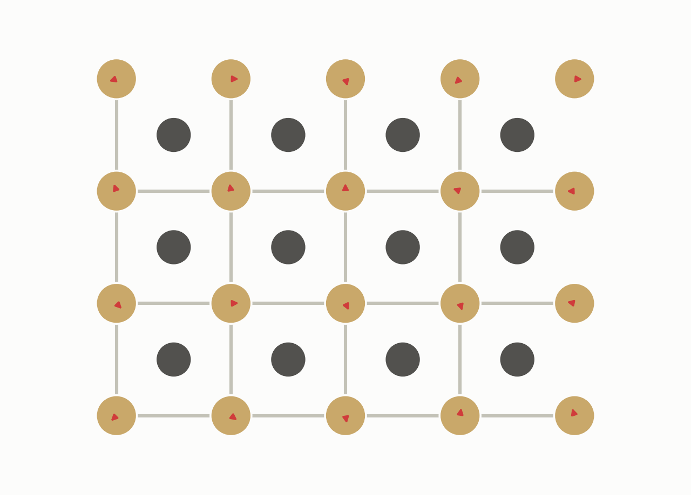
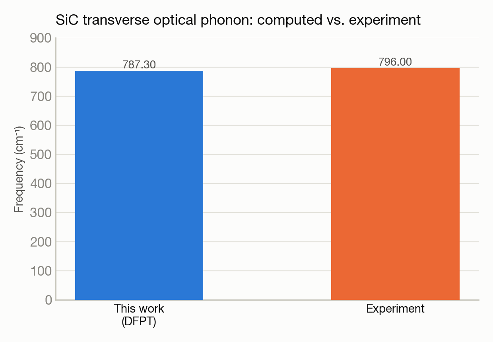

# Silicon carbide's vibrational spectrum from first principles

**System(s):** Polaris · **Code:** Quantum ESPRESSO (DFPT) · **Outcome:** :material-waveform: Success

<figure markdown>
  
  <figcaption>3C-SiC's crystal lattice, vibrating.</figcaption>
</figure>

## The ask

*(This campaign predates verbatim prompt logging — the request below is reconstructed from the campaign's documented design, not a direct quote.)*

> "Compute the zone-center phonon frequencies of 3C-SiC using density functional perturbation theory, extending an earlier SiC total-energy calculation to vibrational properties."

## What happened

Building on an earlier ground-state SiC calculation, this campaign computed the material's vibrational (phonon) spectrum at the Brillouin-zone center using density functional perturbation theory. The pseudopotential library needed for this calculation wasn't bundled with the installed software, so Trinity fetched it automatically via a research-network proxy at runtime — the same class of infrastructure fix seen in the silicon band-structure campaign, now handled routinely.

## Results

<figure markdown>
  
  <figcaption>The computed zone-center phonon frequency lands within 1% of experiment.</figcaption>
</figure>

- Transverse optical phonon frequency at the zone center: 787.3 cm⁻¹, within 1% of the experimental value of 796 cm⁻¹.
- Acoustic phonon modes correctly came out near zero frequency, as required by translational symmetry — a standard correctness check that passed cleanly.
- One longitudinal optical mode needs an additional post-processing correction step to reach full accuracy, noted as a follow-up rather than left unresolved silently.

[← Back to Science campaigns](index.md)
