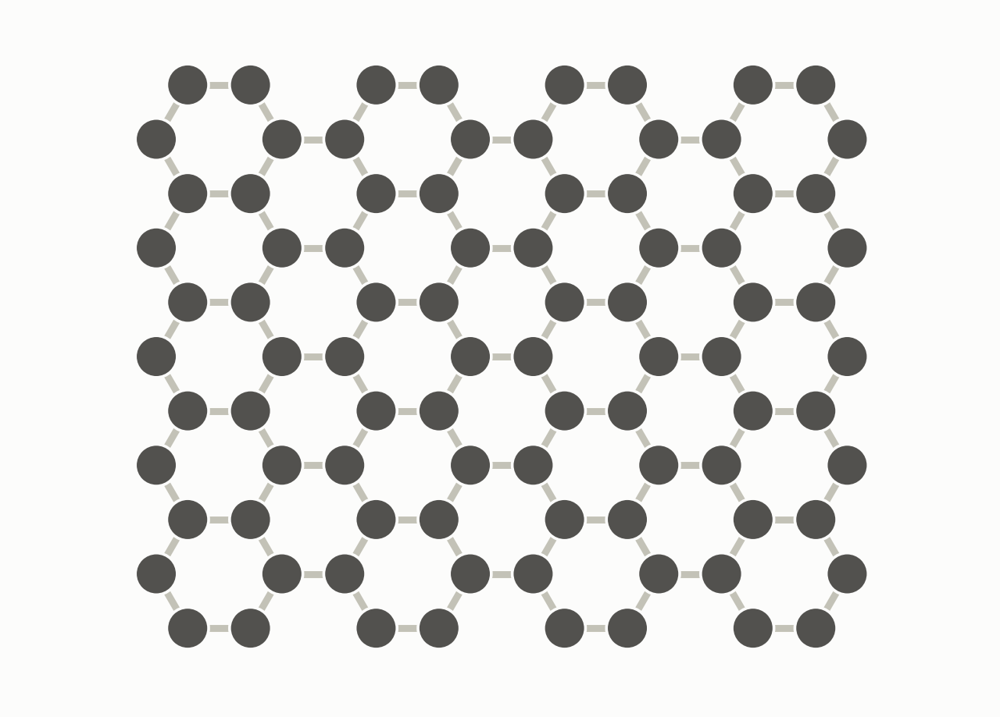
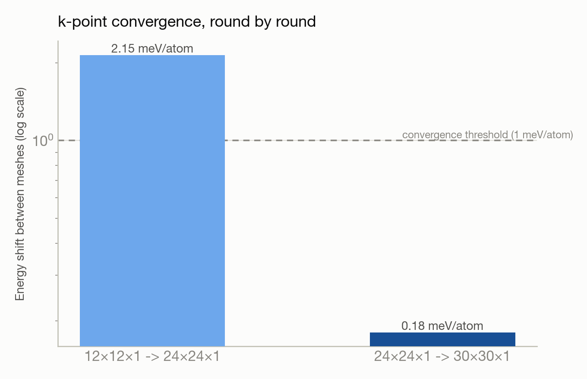

# Graphene band structure via DFT — a 3-round convergence study

**System:** Polaris · **Type:** DFT calculation (Quantum ESPRESSO) · **Outcome:** :material-check-decagram: Success

<figure markdown>
  
  <figcaption>Graphene's honeycomb carbon lattice.</figcaption>
</figure>

## The ask

> "Run a DFT calculation for graphene"

A follow-up request after reviewing the first two rounds of results:

> "Do one more calculation to see the convergence of the k-point. Address all the uncertainty. Figure out general suggestion on compute resources for different system sizes. Should we do a benchmark?"

## What happened

Trinity built a graphene monolayer from a Materials Project graphite structure, ran a PBE calculation, and produced the classic Dirac-cone band structure — zero gap at the K point, linear dispersion, matching published graphene physics. The first pass flagged its own choices (k-mesh, smearing, vacuum thickness) as low-to-medium confidence and asked for scientist guidance instead of stopping at "job succeeded."

The second round tightened the smearing parameter and k-mesh per that feedback, which shifted the total energy by 2.2 meV/atom — proof the first mesh really had been under-converged. Along the way it fought through four dead ends trying to read files back from remote storage (identity/authentication issues, a firewalled protocol, a broken legacy transfer script, offline compute endpoints) before finding a working path.

The third round added an even denser k-mesh, which shifted the energy by only 0.18 meV/atom — confirming the second mesh was already converged — and resolved an apparent "double the expected bands" anomaly from round two (a logging system had duplicated file content, not a physics bug). It closed out by proposing a general node-sizing rule and a benchmark plan for right-sizing future Quantum ESPRESSO runs on Polaris.

## Results

<figure markdown>
  
  <figcaption>Each denser k-mesh moved the energy less than the last — the signature of convergence.</figcaption>
</figure>

- Zero-gap Dirac-cone semimetal confirmed in all three rounds — matches published PBE graphene results.
- k-point convergence resolved: a 24x24x1 mesh is sufficient (only 0.18 meV/atom shift from an even denser mesh, well under the 1 meV/atom threshold).
- This convergence rule is now a confirmed fact Trinity reuses automatically in future graphene calculations, along with draft guidance for sizing compute resources by system size — pending a real benchmark run to confirm it.

[← Back to Trinity runs](index.md)
