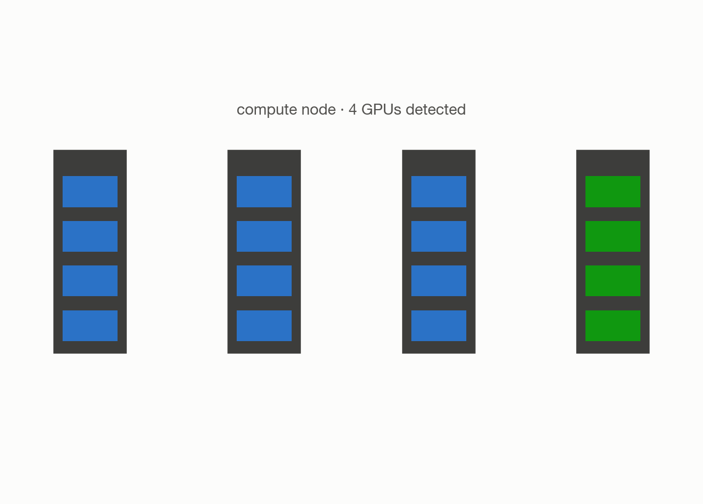

# First job on Perlmutter — and two infrastructure bugs it surfaced

**System:** Perlmutter (NERSC) · **Type:** Infrastructure smoke test · **Outcome:** :material-server: Success

<figure markdown>
  
  <figcaption>A compute node with 4 GPUs — the target of the very first job.</figcaption>
</figure>

## The ask

*(This campaign predates verbatim prompt logging — the request below is reconstructed from the campaign's recorded intent, not a direct quote.)*

> "Run a smoke test on Perlmutter: submit a 1-node job, confirm all GPUs are visible, and verify the job can write to the filesystem with a clean exit."

## What happened

This was an infrastructure validation run, not a science result — confirming Trinity could submit and monitor a job on Perlmutter end-to-end for the first time. It surfaced two non-obvious bugs. First, a Globus data-transfer endpoint couldn't resolve a certain path style, fixed by using an absolute path on the correct endpoint. Second, the job's working-directory resolution logic — borrowed from a pattern that works on ALCF's scheduler — broke on Perlmutter's Slurm scheduler, because Slurm copies the job script to a spool directory before execution rather than leaving it in place. After rewriting the working-directory logic to use an absolute path instead, the corrected job ran cleanly.

## Results

<figure markdown>
  
  <figcaption>The first Perlmutter job correctly detected every GPU on the node.</figcaption>
</figure>

- Final job completed with a clean exit code.
- All 4 GPUs on the allocated node were visible and correctly detected; filesystem write test passed; no errors in the job log.
- Two infrastructure bugs found and fixed, both now confirmed facts Trinity applies automatically to future Perlmutter and NERSC jobs.

[← Back to Trinity runs](index.md)
