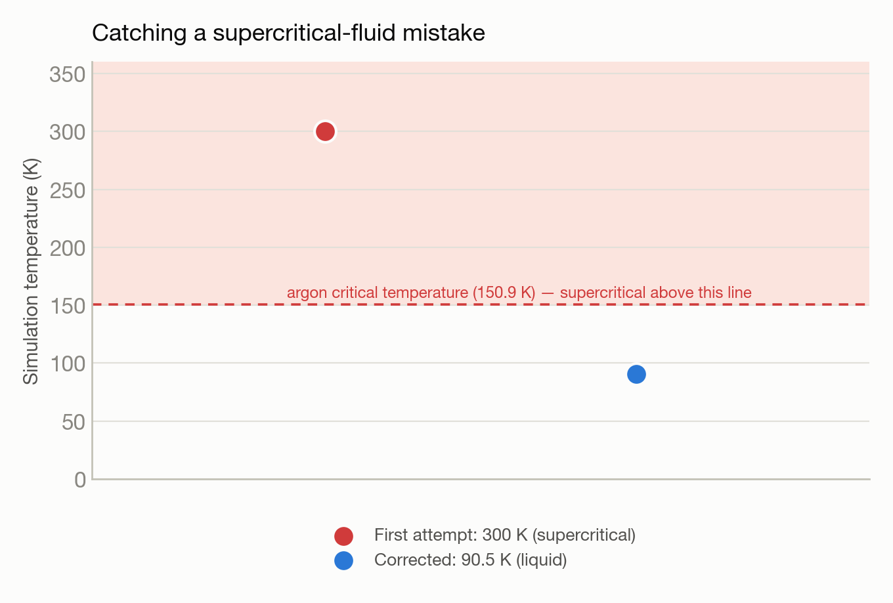

# Liquid argon MD — catching its own supercritical-fluid mistake

**System:** Polaris · **Type:** Molecular dynamics (LAMMPS) · **Outcome:** :material-bug-outline: Success, self-corrected

<figure markdown>
  
  <figcaption>Argon atoms in a simulation box.</figcaption>
</figure>

## The ask

*(This campaign predates verbatim prompt logging — the request below is reconstructed from the campaign's recorded intent, not a direct quote.)*

> "Run a LAMMPS molecular dynamics simulation of liquid argon at 300 K on Polaris and report the final energy."

## What happened

Trinity ran the requested simulation end-to-end after fixing a couple of infrastructure snags — a bad working-directory setting and a resource-request directive that was silently ignored because of where it appeared in the job script.

After the run completed, prompted to double check the result, Trinity caught a real scientific error in its own initial setup: 300 K argon at the density it had chosen is actually a supercritical fluid, not a liquid — well above argon's critical temperature — and the energy was still drifting after the simulation ended, a telltale sign. It corrected the temperature to 90 K and the density to a genuine liquid-argon condition, and reran, producing a physically valid result.

## Results

<figure markdown>
  
  <figcaption>The first attempt landed above argon's critical temperature; the corrected run didn't.</figcaption>
</figure>

- Corrected run at ~90 K: density and pressure both consistent with real liquid argon near its normal boiling point, not the supercritical fluid the first attempt produced.
- Performance: over 375 nanoseconds of simulated time per day on a single GPU node.
- The self-caught error — recognizing a "liquid" request had actually produced a supercritical fluid — is exactly the kind of validity check the platform is designed to do automatically.

[← Back to Trinity runs](index.md)
