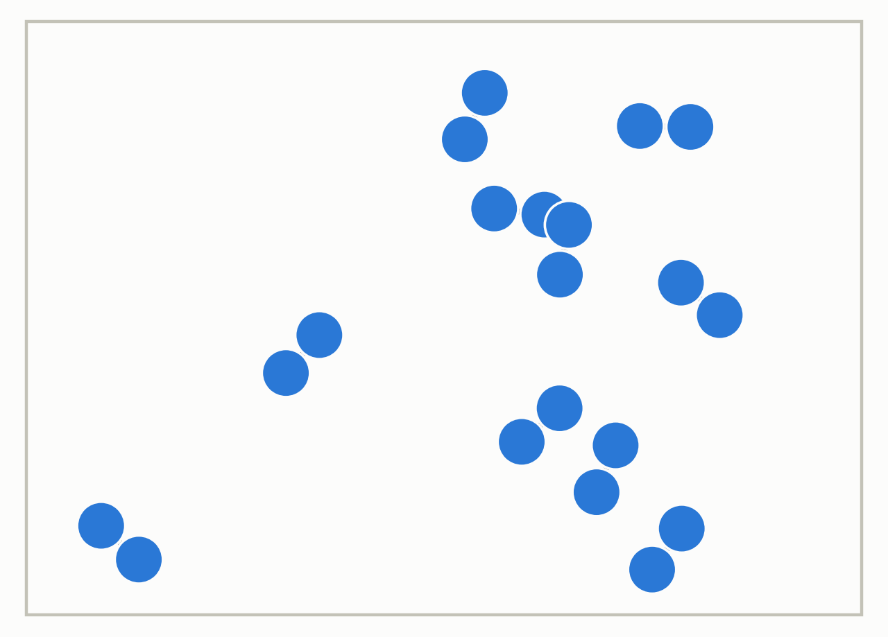
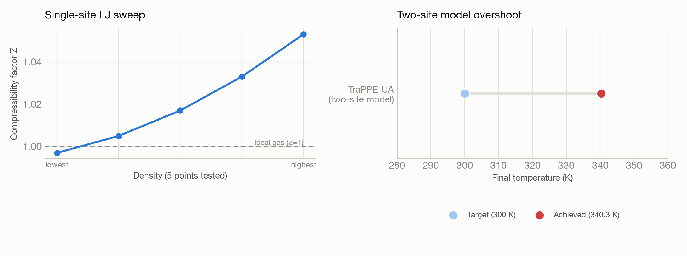

# N2 gas molecular dynamics — two models, one open-ended ask

**System:** Polaris · **Type:** Molecular dynamics (LAMMPS) · **Outcome:** :material-alert-decagram-outline: Partial

<figure markdown>
  
  <figcaption>N2 modeled as diatomic molecules in a simulation box.</figcaption>
</figure>

## The ask

> "Could you please run a MD simulation for N2 gas?"

## What happened

The prompt was deliberately open-ended — no model, ensemble, or conditions specified — and it produced two genuinely different experiments, not two iterations of the same run.

First, Trinity modeled N2 as a single spherical Lennard-Jones site, reusing validated parameters from an earlier argon campaign, and ran a 5-density sweep at 300 K to test the ideal gas law and its departure via the second virial coefficient. This fully succeeded and matched literature trends.

Second, it modeled N2 more realistically as a two-site TraPPE-UA (united-atom) model joined by a flexible bond, aiming for a 10 ps equilibration trajectory at 300 K. The job ran clean — 10,000 steps, no crashes — but the final temperature overshot to 340 K, about 13% above target, because the flexible N-N bond's fast vibration was under-resolved at a 1 fs timestep. Trinity correctly self-diagnosed this as a modeling artifact (the bond should have been rigid or SHAKE-constrained, standard practice) rather than an infrastructure failure, and explicitly reported its own stopping criterion as unmet rather than declaring victory.

## Results

<figure markdown>
  
  <figcaption>A clean ideal-gas sweep alongside a two-site model that overshot its temperature target.</figcaption>
</figure>

- Single-site LJ sweep: compressibility factor Z ranged from 0.997 (low density) to 1.053 (high density), tracking the literature 2nd-virial trend for N2 at 300 K; temperature held to 298.9-302.3 K across all 5 runs.
- Two-site TraPPE-UA run: completed 10 ps with no crashes, but final temperature 340.29 K vs. 300 K target — a genuine physics/modeling issue (should use a rigid bond), not a run failure, and reported as such.
- Both experiments assessed their own scientific validity rather than just reporting "job completed."

[← Back to Trinity runs](index.md)
