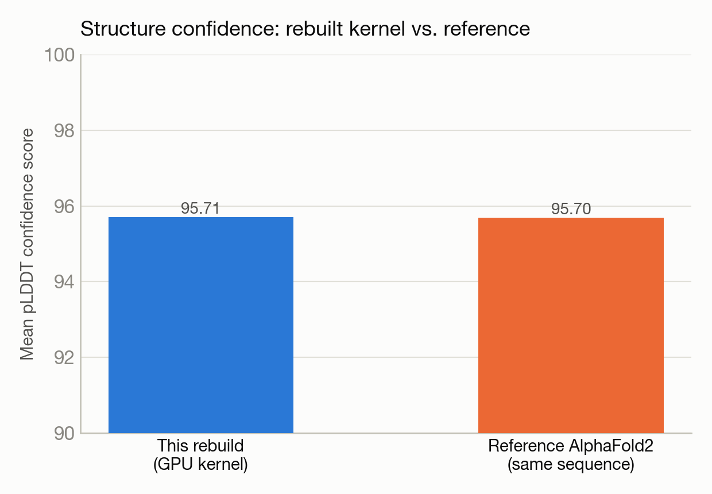

# Fixing OpenFold's GPU kernel — from silent CPU fallback to a verified rebuild

**System:** Polaris · **Type:** Software build / GPU kernel fix · **Outcome:** :material-bug-outline: Success

<figure markdown>
  
  <figcaption>A folded protein structure, schematically.</figcaption>
</figure>

## The ask

> "now, let us fix OpenFold, if you have to rebuild, then rebuild"

## What happened

OpenFold, a PyTorch reimplementation of AlphaFold2, was crashing at inference time. The root cause was buried: its custom fused-attention CUDA kernel had silently been built as a CPU-only stub. An earlier session had unset an environment variable to dodge an unrelated compiler failure, which — without anyone noticing — steered the kernel's build script onto its no-GPU code path.

Trinity diagnosed the root cause by reading the build script's branching logic, matched the CUDA toolkit version to the one PyTorch was actually built against, worked around a missing compiler component, and rebuilt the extension as a real CUDA kernel on a GPU node.

## Results

<figure markdown>
  
  <figcaption>The rebuilt GPU kernel matches a previously-validated reference run almost exactly.</figcaption>
</figure>

- Rebuilt kernel confirmed to link the real CUDA runtime library, compiled for A100 GPU architecture — a genuine GPU kernel, not a CPU stub.
- GPU inference completed in 9.18 seconds on one A100, producing a 78-residue protein structure.
- Mean confidence score (pLDDT) = 95.71, matching a previously-validated AlphaFold2 reference run (95.7) on the same sequence and weights — direct proof the GPU path is numerically correct, not just non-crashing.

[← Back to Trinity runs](index.md)
