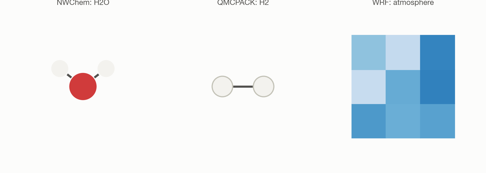
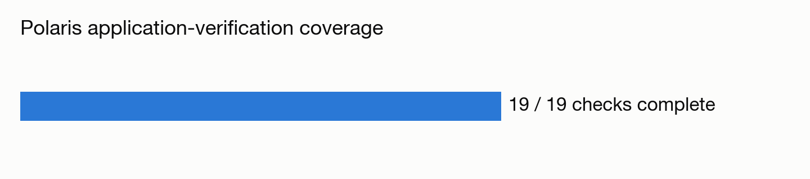

# Closing out Polaris application verification: NWChem, QMCPACK, and WRF

**System:** Polaris · **Type:** Multi-code functional verification · **Outcome:** :material-check-decagram: Success

<figure markdown>
  
  <figcaption>One physical system per code: a water molecule, an H2 molecule, an atmospheric grid.</figcaption>
</figure>

## The ask

*(This campaign predates verbatim prompt logging — the request below is reconstructed from the campaign's recorded intent, not a direct quote.)*

> "Fix and complete the remaining Polaris application verification smoke tests — NWChem, QMCPACK, and WRF — so all planned code-verification checks pass."

## What happened

This campaign closed out the last three of a planned set of Polaris application-verification checks. QMCPACK initially failed because a setup script hardcoded a pseudopotential path incorrectly; once fixed, its diffusion Monte Carlo run completed and matched the reference value to 5 significant figures. NWChem had earlier been misdiagnosed as a parallel-runtime fault, but the real cause was a missing environment variable pointing at the wrong basis-set library. WRF's install only shipped real-data binaries, so Trinity had to compile the idealized-case executable from source. All three were fixed and completed entirely through automated tooling with no direct system access, because the usual authentication token had expired.

## Results

<figure markdown>
  
  <figcaption>The last three application checks brought Polaris verification to full coverage.</figcaption>
</figure>

- NWChem: water B3LYP/6-31G* total energy computed correctly, matching expected physics for this level of theory.
- QMCPACK: H2 diffusion Monte Carlo energy matched the reference value to 5 significant digits.
- WRF: idealized quarter-supercell test case ran to successful completion for a 1-simulated-hour run.
- Brought Polaris application-verification coverage to complete (19/19 planned checks).

[← Back to Trinity runs](index.md)
