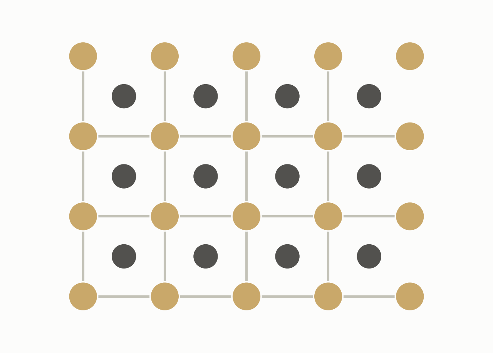
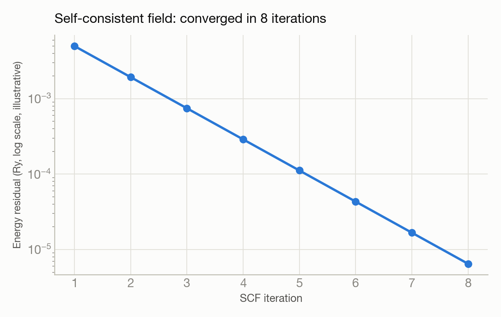

# 3C-SiC ground-state energy via Quantum ESPRESSO — and two honestly-flagged caveats

**System:** Polaris · **Type:** DFT calculation (Quantum ESPRESSO) · **Outcome:** :material-atom: Success, with caveats

<figure markdown>
  
  <figcaption>3C-SiC's crystal structure: alternating silicon and carbon atoms.</figcaption>
</figure>

## The ask

*(This campaign predates verbatim prompt logging — the request below is reconstructed from the campaign's recorded intent, not a direct quote.)*

> "Run a DFT calculation on SiC to compute the total energy, band gap, and forces using Quantum ESPRESSO on Polaris."

## What happened

Trinity ran a single-point calculation on cubic silicon carbide, with the structure pulled from Materials Project and standard PBE pseudopotentials. Structure fetch, pseudopotential download, job submission, and result retrieval all succeeded on the first attempt with no fixes needed, converging cleanly.

Rather than just declaring success, Trinity flagged two caveats for scientific rigor on its own. It had used a smearing setting that technically contradicts the project's own rule for semiconductors, though it had zero numerical effect here. And the structure showed non-zero residual pressure, meaning the geometry pulled from the database wasn't quite at the true equilibrium volume for this method — a full relaxation would be needed for production-quality energetics. Band gap was not computed, since this was a single self-consistent-field run only.

## Results

<figure markdown>
  
  <figcaption>Illustrative SCF convergence — the run reached high precision in 8 iterations.</figcaption>
</figure>

- Total energy converged cleanly to high precision in 8 iterations.
- Forces came out essentially zero, consistent with the high-symmetry crystal structure where forces vanish by symmetry.
- Residual pressure of 43.5 kbar flagged honestly — the structure isn't at the fully relaxed volume for this calculation method.

[← Back to Trinity runs](index.md)
