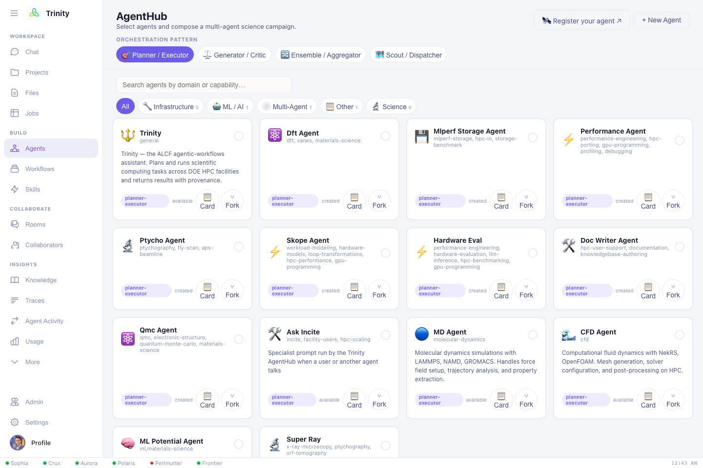
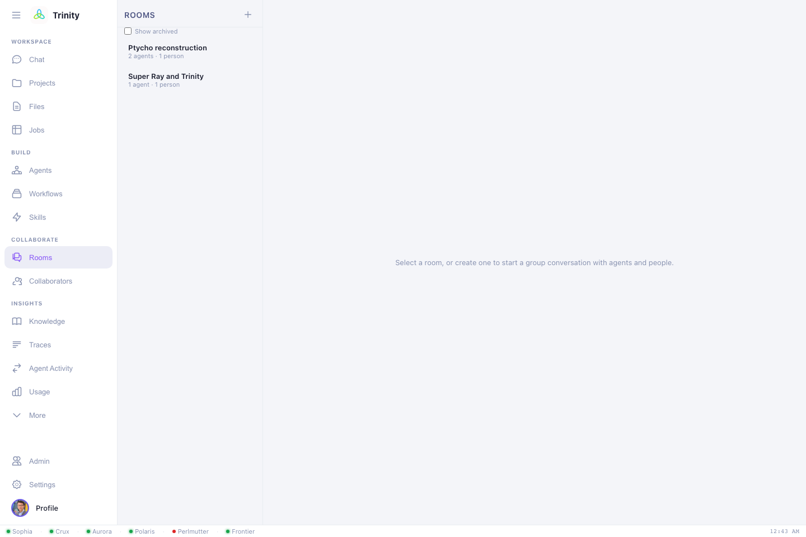

# Agents & rooms

Beyond one-on-one chat, Trinity lets you bring **specialist agents** and **other
people** into shared conversations. This is how multi-step, multi-domain campaigns
get coordinated.

## AgentsHub

The **AgentsHub** view lists the agents available to you — both Trinity's built-in
domain agents and **external** third-party agents that have been registered. Each
agent has a **card** describing:

- **Profile** — what it does, its domains, and which systems it targets.
- **Skills** — the named capabilities it offers.
- **Knowledge** — the validated domain facts it draws on.
- **Query/response contract + token** — how it's called (for developers).

Click an agent to view its card; use **Copy A2A JSON** to grab the
machine-readable, [A2A](https://github.com/google/A2A)-aligned descriptor.

## Agent Rooms (group conversations)

An **Agent Room** is a shared space with human **members** and AI **agents**, a
durable transcript, and live updates. Use a room when a task spans more than one
specialty — e.g. a DFT agent proposes structures, an ML agent screens them, and you
steer the campaign.

### Creating a room with agents and people together

Click **New room**, give it a name, and pick from two lists in the same
dialog — **Agents** (from the AgentsHub) and **People** (your collaborators) —
checking as many of each as the task needs. There's no separate flow for
"add an agent" vs. "add a person": both lists live in the one room, and you're
always included as a member.

The same dialog also sets the room's **mode** (mention-only or moderated),
a **max agent turns** guard, and an optional **max spend** cap (see
[Tracking cost & setting a budget](#tracking-cost-setting-a-budget) below).

### Turn-taking

Rooms default to **mention-only**: an agent speaks **only when a human `@mentions`
it**, so there are no runaway agent-to-agent loops.

> @dft-agent relax these three structures on Polaris, then
> @ml-agent rank them by formation energy.

An optional **moderated** mode lets a moderator turn pick the next speaker and lets
agents hand off to each other — and it **pauses for a human** whenever it's your
turn, notifying you if you've stepped away.

### People are first-class

When it's a human's turn, connected members see a **"🟢 Your turn"** prompt; absent
members get notified out-of-band (push / email / Slack via the Trinity identity), and
the conversation resumes when they reply.

### Managing a room after it's created

Open **⚙ Manage room** (the room header) to rename it or change who's in it.
Any member can add or remove **agents**; only the room's **creator or an
admin** can change the **people** list — everyone else sees it read-only.

### Exporting a room's transcript

The same **Manage room** panel has **⬇ Markdown** and **⬇ JSON** buttons.
Both walk the room's *entire* history (not just what's currently loaded on
screen) and download it as a single file — Markdown for sharing in a doc,
issue, or email; JSON if you want the structured record (sender, timestamp,
tool calls) for your own tooling.

### Tracking cost & setting a budget

Every room with any recorded spend shows a live **`$spent[/ $cap] · tokens`**
readout next to its name, using the same per-model price table (Opus / Sonnet
/ Haiku, $ per million tokens) that drives the account-wide **Usage** view —
so a room's number and your overall usage report are always consistent.

To cap spend, set **Max spend ($)** when you **create** the room — leave it
blank for no cap. Once the room's running total reaches that cap, agents stop
replying and post a message flagging the cap instead; there's currently no
in-app way to raise the cap on an existing room, so pick it deliberately
upfront (or start a fresh room if you need more budget). The cap and the
readout both cover **local Trinity agents only** — an externally-hosted
`@mention`-able agent (see below) bills to its own infrastructure and isn't
metered or blocked by the room cap.

## Bringing in your own agent

Any agent that speaks A2A (or OpenAI-chat / plain REST) can be made
`@mention`-able in Trinity rooms — it keeps running on your own infrastructure; you
just register a small public descriptor. That's the **Extend** side of this site:

- [:octicons-arrow-right-24: Register an agent](../register-an-agent.md)
- [:octicons-arrow-right-24: Contribute a skill](../contribute-a-skill.md)
- [:octicons-arrow-right-24: Agent Card spec](../agent-card-spec.md)

Next: **[Roles & access →](roles-and-access.md)**
