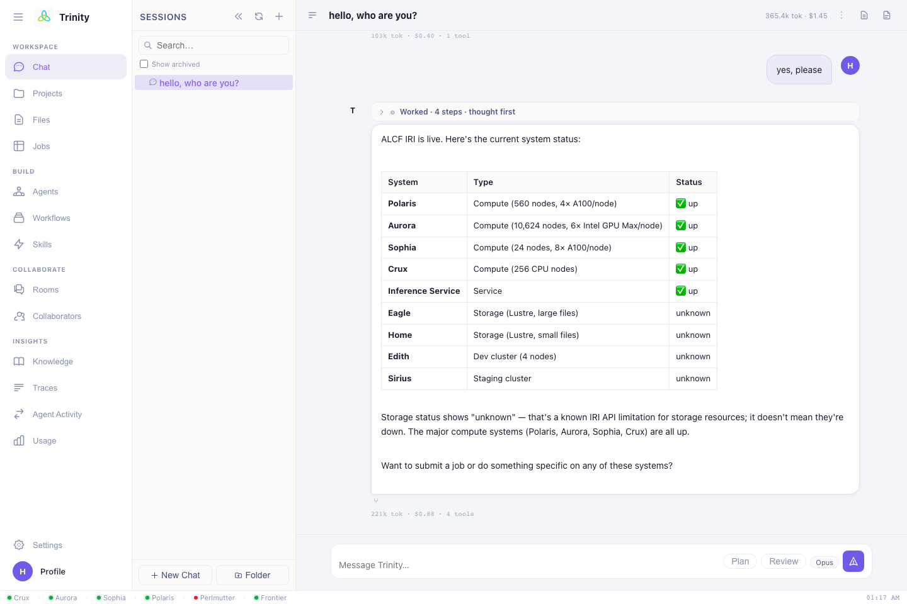

# The chat interface

The **Chat** view is where you do everything. You type a request; Trinity reasons
about it, calls the tools it needs (job submission, file access, data transfer,
status checks), and streams the result back in real time.

## Asking for work

Be specific about **what**, **where**, and **how big**. Trinity fills the rest from
your [HPC defaults](settings.md) and will ask if something essential is missing.

Good first requests:

> Check if Aurora is up, then build LAMMPS from source on it.

> Run a Quantum ESPRESSO SCF calculation for this structure on Polaris using the
> `debug` queue, 1 node.

> Train GPT-2 on 4 Aurora nodes and track the run.

> Port this CUDA kernel to Intel GPUs for Aurora.

> Move the outputs in my last job to my laptop with Globus.

### Example prompts on the empty screen

When a chat is empty, Trinity shows starter prompts you can click, including:

- **DFT Calculation** — Quantum ESPRESSO on Polaris
- **LLM Training** — GPT-2 on Aurora
- **MD Simulation** — LAMMPS on Polaris
- **System Status** — check ALCF availability
- **Storage Benchmark** — DLIO on Eagle
- **Port to Aurora** — CUDA → Intel GPU

## Choosing a model

A model picker lets you choose the reasoning model per message:

| Model | When to use |
|---|---|
| **Opus 4.8** *(default)* | Hardest planning, multi-step campaigns, debugging builds. |
| **Sonnet 4.6** | Fast, capable everyday work. |
| **Haiku 4.5** | Quick, cheap lookups and short answers. |

## Steering a running response

If Trinity heads in the wrong direction, use **Steer** to interrupt and redirect
mid-task without losing the conversation — e.g. *"stop — use the `prod` queue, not
`debug`, and 4 nodes."* You can also **Stop** generation entirely.

## Artifacts panel

When a response contains a script, config, or code block, it appears in the
**Artifacts** panel on the right where you can **view, copy, save** it to your
workspace, or open it in the file editor — handy for grabbing a generated `run.sh`
or input deck.

## Sessions & history

- Every conversation is a **session**, listed in the left sidebar; search or start a
  new one any time.
- **Rename** a session, **export** it as Markdown, or open its
  **[Trace Timeline](index.md)** to see every tool call and observation in order.
- Sessions are **private to you** and persist across logins.

!!! tip "Context meter"
    The composer shows how much of the model's context window the current session is
    using. For a long, unrelated next task, start a **new session** to keep Trinity
    focused.

Next: **[Running HPC jobs →](running-jobs.md)**
