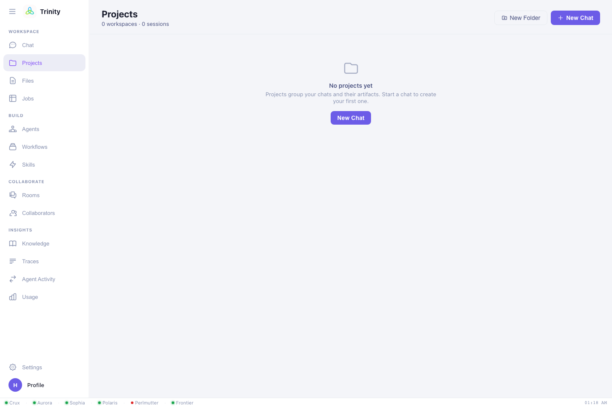
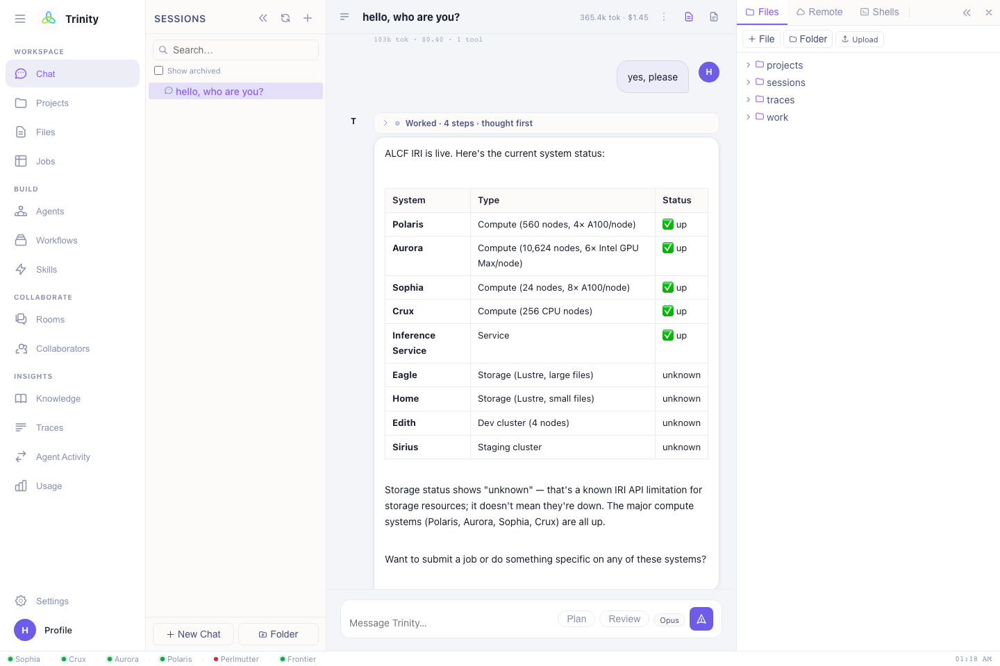

# Files & projects

Trinity gives you a workspace for the scripts, inputs, and outputs that flow through
your sessions — browsable in the UI and reachable by the agent during a chat.

## Projects

A **project** is a named workspace that groups related chats and files. Use the
**Projects** view to create projects (and folders within them) so a campaign's
sessions and data stay together — e.g. a `qe-screening` project for a DFT study, or
`gpt2-aurora` for a training run.

- Each chat belongs to a project workspace.
- Files you upload or that jobs produce live under the project.
- Your projects are **private to you** (tenant isolation); admins manage shared
  spaces.

## The file browser

The **Files** view (and the file panel beside the chat) lets you:

- **Browse** the directory tree of your workspace.
- **Open & read** files — logs, outputs, configs, source.
- **Edit** text files in place.
- **Upload** files from your computer.
- **Download** results back to your machine.
- **Create, move, rename, and delete** files and folders.

!!! tip "Edit while you chat"
    Keep the file panel open next to the chat to inspect an input deck or a generated
    `run.sh` without leaving the conversation. Artifacts from a response can be saved
    straight into your workspace — see
    [the Artifacts panel](chat.md#artifacts-panel).

## Files and the agent

When you ask Trinity to *"run my `train.py`"* or *"fix the error in this log,"* it
reads and writes files in your workspace as part of the task. Generated job scripts,
inputs, and fetched outputs land there too, so everything for a run is in one place.

## Moving data between facilities

To get data **in or out** of an HPC system, ask Trinity to run a **Globus**
transfer:

> Transfer the `outputs/` folder from my last Polaris job to Perlmutter scratch.

> Download the final checkpoint to my laptop.

Trinity starts the transfer and reports its status (you can also watch it in
**Jobs**).

Next: **[Settings →](settings.md)**
