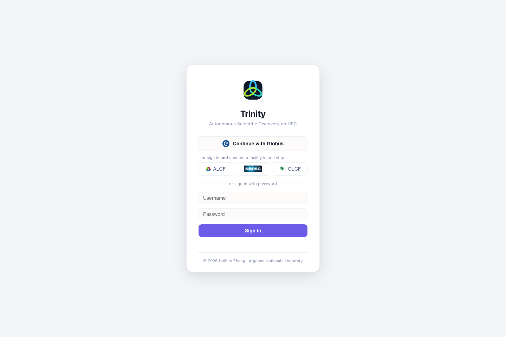
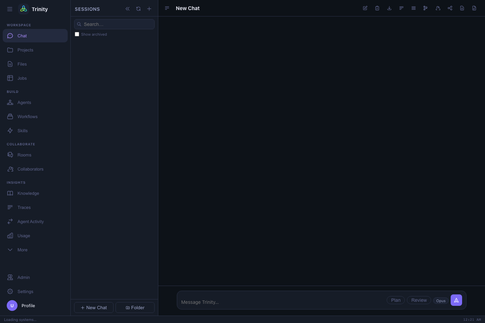

# Getting started

## 1. Open Trinity

Go to **<https://trinity.lionlambstone.org>** in your browser.

## 2. Sign in with Globus

Click **Continue with Globus**. You authenticate with your existing DOE facility
identity (the same Globus login you use for data transfer), so there is no separate
Trinity password to manage. A username/password field is also available, for
admin-provisioned accounts.

On first sign-in, Trinity **auto-provisions** your account with the **editor**
role — enough to chat, submit jobs, run tools, and browse your own files. (See
[Roles & access](roles-and-access.md) for what each role can do.)

!!! note "Sessions"
    Your login is kept in a secure browser cookie that lasts ~24 hours. After it
    expires, just sign in with Globus again.

## 3. Authorize compute at OLCF / NERSC (only if you'll use them)

ALCF systems work as soon as you're signed in. For **OLCF (Frontier)** and
**NERSC (Perlmutter)**, Trinity needs a separate compute authorization tied to
*your* identity at that facility. In **Settings → Authentication** you'll find
**Connect OLCF** / **Connect NERSC** buttons — click them once and complete the
facility login. Trinity stores the resulting tokens per-user and refreshes them
automatically.

## 4. Set your HPC defaults

Before your first job, open **Settings → HPC & Compute** and fill in, **per
system**:

- **Default system** — e.g. Polaris, Aurora, Perlmutter, Frontier, Crux
- **Default queue** — e.g. `debug`, `prod`, `preemptable`
- **Allocation** — the project/account your jobs are charged to
- **HPC username** — your username on that facility

These become the defaults Trinity uses when you don't specify them in chat, so you
can just say *"submit a 2-node job"* and it knows where and under what allocation.
→ [Settings](settings.md)

## 5. Say hello

Open **Chat** and try something small to confirm everything is wired up:

> **You:** Check whether Polaris is up and show me the current queue.

> **You:** Submit a 1-node `debug` job on Polaris that runs `hostname`, then tell me
> when it finishes.

Trinity will stream its reasoning and tool calls as it works; the **Jobs** view
shows the live status of anything running in the background.

!!! tip "Tell Trinity who you are"
    Set **custom instructions** in **Settings → Personalization** once, and every
    chat starts with that context — your default system, allocation, and how you
    like answers. See [Settings](settings.md#personalization-custom-instructions).

Next: **[The chat interface →](chat.md)**
