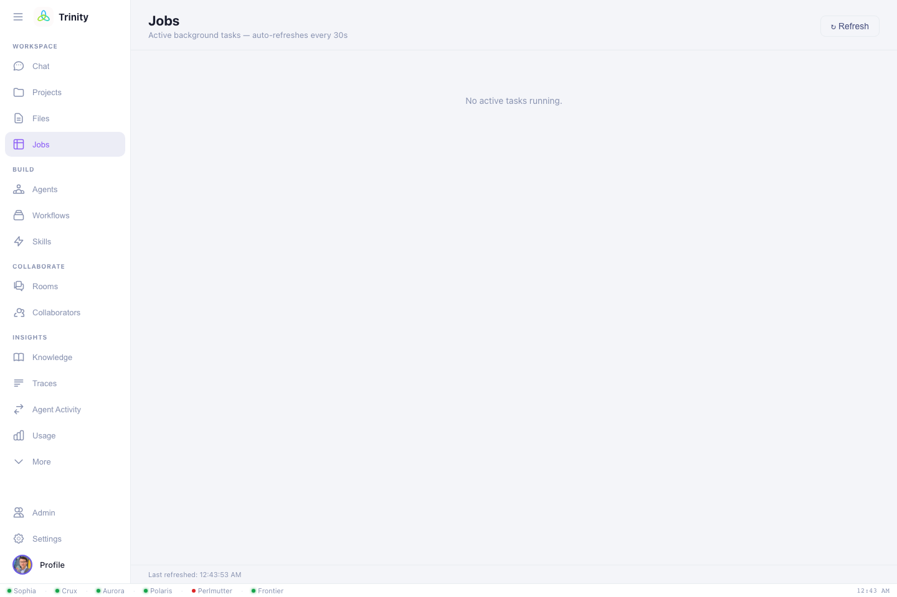

# Running HPC jobs

Submitting and monitoring jobs is Trinity's core job. You describe the work; Trinity
writes the batch script, submits it through the facility's API under **your**
identity and allocation, and watches it to completion.

## Supported systems

| Facility | Systems | Scheduler |
|---|---|---|
| **ALCF** | Polaris, Aurora, Crux, Sophia, Sirius | PBS Pro |
| **NERSC** | Perlmutter | Slurm |
| **OLCF** | Frontier | Slurm |

ALCF works as soon as you're signed in. For OLCF/NERSC, connect compute once in
**Settings → Authentication** (see [Getting started](getting-started.md#3-authorize-compute-at-olcf-nersc-only-if-youll-use-them)).

## Submitting a job

Just ask. Trinity uses your [HPC defaults](settings.md) for anything you leave out:

> Submit a 2-node job on Polaris in the `debug` queue that runs my `train.py` for
> 30 minutes.

What Trinity handles for you:

1. **Writes the job script** — correct scheduler directives, modules, and launch
   command for that system.
2. **Picks the allocation** — your default account (or the one you name) so billing
   and the run directory stay consistent.
3. **Submits** through the facility API.
4. **Monitors** — polls status with sensible backoff and reports state changes.
5. **Returns results** — summarizes output and points you to the files.

You can override any detail in plain language: nodes, queue, walltime, allocation,
working directory, modules, or the exact command.

## Watching progress — the Jobs view

The **Jobs** view lists background tasks and submissions with live status. A badge
in the sidebar shows how many are active. Open it to see each job's state
(queued → running → completed/failed), and jump back to the chat that launched it.



Once something is running, entries look like:

```
Jobs
────────────────────────────────────────────
 ● qe-scf-polaris      RUNNING    Polaris · debug · 1 node
 ✓ build-lammps-aurora COMPLETED  Aurora
 ✗ gpt2-train-aurora   FAILED     Aurora · prod · 4 nodes  → open chat
```

!!! note "Long jobs survive disconnects"
    Trinity runs your request as a background task, so a job keeps running and being
    monitored even if you close the tab. Come back later and the **Jobs** view and
    the session will have the latest status.

## Getting results

- **In chat** — Trinity summarizes stdout/stderr and key outputs when a job
  finishes.
- **In Files** — browse the run's working directory, open output files, and
  download them. → [Files & projects](files-and-projects.md)
- **Move elsewhere** — ask Trinity to Globus-transfer outputs to another facility or
  your laptop.

## Building & porting software

The same flow covers compilation, not just runs:

> Build NekRS on Aurora and run its smoke test.

> Port this HIP code to run on Frontier.

Trinity selects the right toolchain/modules for the target system and iterates the
build on a compute node, reporting errors and fixes as it goes.

Next: **[Files & projects →](files-and-projects.md)**
