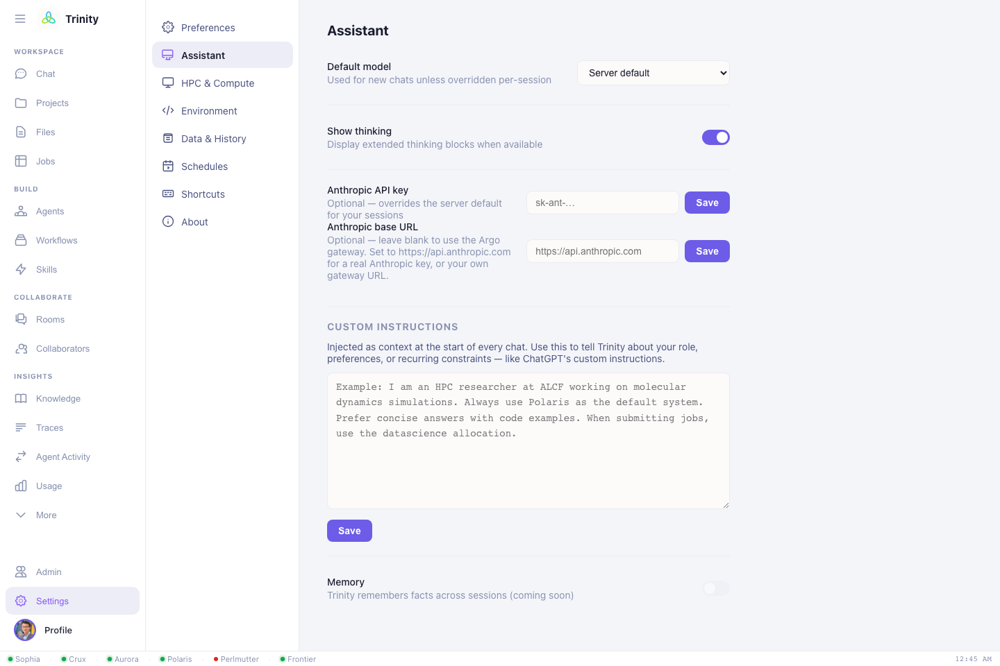

# Settings

Open **Settings** from the sidebar to configure how Trinity behaves for you. The
panes you'll use most:

## Personalization (custom instructions)

**Settings → Personalization** holds **custom instructions** that are injected into
*every* chat. Set this once so you don't repeat yourself:

```
I am an HPC researcher at ALCF working on molecular dynamics.
Default to Polaris and the datascience allocation.
Prefer concise answers with code examples.
When submitting jobs, always confirm node count and walltime first.
```

This is the single highest-leverage setting — it makes every session start with
your context.



## HPC & Compute (job defaults)

**Settings → HPC & Compute** sets the defaults Trinity uses when you don't spell
them out in chat. These are saved **per system**, so switching your default system
restores that system's own queue/allocation/username:

| Field | Example | Used for |
|---|---|---|
| **Default system** | Polaris / Aurora / Perlmutter / Frontier / Crux | where jobs go |
| **Default queue** | `debug`, `prod`, `preemptable`, `demand` | scheduler queue |
| **Allocation** | your project/account | what jobs are charged to |
| **HPC username** | your facility username | run-directory + identity |

With these set, *"submit a 2-node job"* is enough — Trinity knows the rest.

## Models

**Settings → Models** sets your **default reasoning model** (Opus 4.8 / Sonnet 4.6 /
Haiku 4.5), toggles whether extended thinking is shown, and lets you supply your own
API key if your deployment allows it. You can still override the model per message in
the chat. → [Choosing a model](chat.md#choosing-a-model)

## Authentication

**Settings → Authentication** shows your Globus SSO status and lets you **connect
OLCF and NERSC** compute (one-time, per facility) and review token expiry. Trinity
refreshes tokens automatically; reconnect here if one lapses. → [Getting started](getting-started.md#3-authorize-compute-at-olcf-nersc-only-if-youll-use-them)

## Environment

**Settings → Environment** stores **per-user environment variables** that your tools
need — e.g. experiment-tracking tokens, service credentials, or API keys. They're
scoped to your account and injected when Trinity runs work on your behalf.

## Profile

The **Profile** view holds your identity — name, email, institution, department, and
an avatar. Your HPC username is set automatically after Globus login.

## Other panes

**General** (theme, notifications, font sizes), **Security** (account), and
**Data & History** (export your sessions) round out the settings.

!!! warning "Allocations & queues are real"
    Trinity submits jobs under the allocation you configure here — they consume your
    real compute hours. Double-check **allocation** and **queue** before large runs,
    and consider a custom instruction that asks Trinity to confirm node count and
    walltime first.

Next: **[Agents & rooms →](agents-and-rooms.md)**
